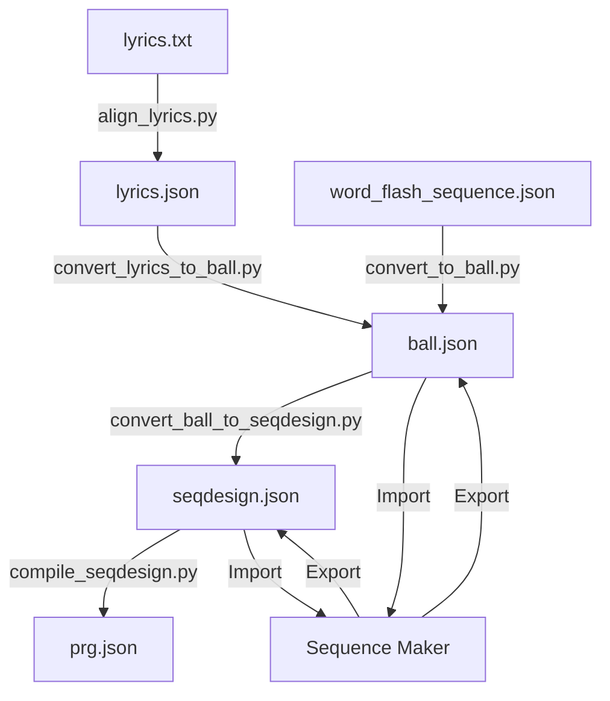

# Detailed Implementation Plan: Lyrics Timestamp Extraction and File Format Standardization

This document provides comprehensive instructions for implementing a standardized file format system for the LTX Guru sequence maker application, with a focus on lyrics timestamp extraction and conversion between different file formats.

## Table of Contents
1. [File Format Standardization](#1-file-format-standardization)
2. [Converter Scripts Implementation](#2-converter-scripts-implementation)
3. [Sequence Maker Application Updates](#3-sequence-maker-application-updates)
4. [Documentation Updates](#4-documentation-updates)
5. [Testing and Validation](#5-testing-and-validation)

## 1. File Format Standardization

### 1.1. Define Standard File Extensions

Create a standardized file extension system with the following formats:

| File Type | Extension | Description |
|-----------|-----------|-------------|
| Sequence Design Files | `.seqdesign.json` | High-level sequence design files |
| PRG JSON Files | `.prg.json` | Compiled program files for LTX balls |
| Ball Sequence Files | `.ball.json` | Single ball color sequences |
| Lyrics Timestamps | `.lyrics.json` | Timestamped/aligned lyrics |
| Audio Analysis Reports | `.analysis.json` | Audio analysis data |

### 1.2. Define Ball Sequence Format (`.ball.json`)

Create a standardized format for single ball sequences:

```json
{
  "metadata": {
    "name": "Ball Sequence Name",
    "default_pixels": 4,
    "refresh_rate": 50,
    "total_duration": 134.95,
    "audio_file": "path/to/audio.mp3"
  },
  "segments": [
    {
      "start_time": 0.0,
      "end_time": 10.7,
      "color": [0, 0, 0],
      "pixels": 4
    },
    {
      "start_time": 10.7,
      "end_time": 11.03,
      "color": [0, 0, 255],
      "pixels": 4
    }
    // Additional segments...
  ]
}
```

### 1.3. Ensure Sequence Design Format (`.seqdesign.json`) Compliance

All sequence designs should follow this standard format:

```json
{
  "metadata": {
    "title": "Sequence Name",
    "total_duration_seconds": 134.95,
    "target_prg_refresh_rate": 50,
    "default_pixels": 4,
    "audio_file_path": "path/to/audio.mp3",
    "default_base_color": {"name": "black"}
  },
  "effects_timeline": [
    {
      "id": "word_flash_effect",
      "type": "solid_color",
      "description": "Flash blue on each word",
      "timing": {
        "start_seconds": 10.7,
        "end_seconds": 11.03
      },
      "params": {
        "color": {"rgb": [0, 0, 255]}
      }
    }
    // Additional effects...
## 2. Converter Scripts Implementation

### 2.1. Create Converters Directory Structure

Create a new directory structure for the converters:

```
roocode_sequence_designer_tools/
└── converters/
    ├── __init__.py
    ├── convert.py
    ├── convert_to_ball.py
    ├── convert_ball_to_seqdesign.py
    └── convert_lyrics_to_ball.py
```

### 2.2. Create `convert_to_ball.py` Script

Create a new file `roocode_sequence_designer_tools/converters/convert_to_ball.py`:

```python
#!/usr/bin/env python3
"""
Convert word_flash_sequence.json to standardized ball.json format
"""

import json
import os
import sys
import argparse

def convert_word_flash_to_ball(input_path, output_path):
    """
    Convert word_flash_sequence.json to standardized ball.json format
    
    Args:
        input_path (str): Path to input word_flash_sequence.json file
        output_path (str): Path to output .ball.json file
    """
    # Load input file
    with open(input_path, 'r') as f:
        word_flash_data = json.load(f)
    
    # Create ball sequence format
    ball_sequence = {
        "metadata": {
            "name": word_flash_data.get("name", "Ball Sequence"),
            "default_pixels": word_flash_data.get("default_pixels", 4),
            "refresh_rate": word_flash_data.get("refresh_rate", 50),
            "total_duration": word_flash_data.get("total_duration", 0),
            "audio_file": word_flash_data.get("audio_file", "")
        },
        "segments": []
    }
    
    # Extract timeline segments
    if "timelines" in word_flash_data and len(word_flash_data["timelines"]) > 0:
        timeline = word_flash_data["timelines"][0]
        ball_sequence["segments"] = timeline.get("segments", [])
    
    # Write output file
    output_dir = os.path.dirname(output_path)
    if output_dir and not os.path.exists(output_dir):
        os.makedirs(output_dir)
        
    with open(output_path, 'w') as f:
        json.dump(ball_sequence, f, indent=2)
    
    print(f"Converted {input_path} to {output_path}")

def main():
    parser = argparse.ArgumentParser(description="Convert word_flash_sequence.json to standardized ball.json format")
    parser.add_argument("input_file", help="Path to input word_flash_sequence.json file")
    parser.add_argument("output_file", help="Path to output .ball.json file")
    
    args = parser.parse_args()
    
    convert_word_flash_to_ball(args.input_file, args.output_file)

if __name__ == "__main__":
    main()
```

### 2.3. Create `convert_ball_to_seqdesign.py` Script

Create a new file `roocode_sequence_designer_tools/converters/convert_ball_to_seqdesign.py`:

```python
#!/usr/bin/env python3
"""
Convert ball.json to seqdesign.json format
"""

import json
import os
import sys
import uuid
import argparse

def convert_ball_to_seqdesign(input_path, output_path):
    """
    Convert ball.json to seqdesign.json format
    
    Args:
        input_path (str): Path to input .ball.json file
        output_path (str): Path to output .seqdesign.json file
    """
    # Load input file
    with open(input_path, 'r') as f:
        ball_data = json.load(f)
    
    # Create sequence design format
    seqdesign = {
        "metadata": {
            "title": ball_data.get("metadata", {}).get("name", "Sequence Design"),
            "total_duration_seconds": ball_data.get("metadata", {}).get("total_duration", 0),
            "target_prg_refresh_rate": ball_data.get("metadata", {}).get("refresh_rate", 50),
            "default_pixels": ball_data.get("metadata", {}).get("default_pixels", 4),
            "audio_file_path": ball_data.get("metadata", {}).get("audio_file", ""),
            "default_base_color": {"name": "black"}
        },
        "effects_timeline": []
    }
    
    # Convert segments to effects
    for segment in ball_data.get("segments", []):
        effect = {
            "id": f"segment_{str(uuid.uuid4())[:8]}",
            "type": "solid_color",
            "description": f"Segment from {segment['start_time']} to {segment['end_time']}",
            "timing": {
                "start_seconds": segment["start_time"],
                "end_seconds": segment["end_time"]
            },
            "params": {
                "color": {"rgb": segment["color"]}
            }
        }
        seqdesign["effects_timeline"].append(effect)
    
    # Write output file
    output_dir = os.path.dirname(output_path)
    if output_dir and not os.path.exists(output_dir):
        os.makedirs(output_dir)
        
    with open(output_path, 'w') as f:
        json.dump(seqdesign, f, indent=2)
    
    print(f"Converted {input_path} to {output_path}")

def main():
    parser = argparse.ArgumentParser(description="Convert ball.json to seqdesign.json format")
    parser.add_argument("input_file", help="Path to input .ball.json file")
    parser.add_argument("output_file", help="Path to output .seqdesign.json file")
    
    args = parser.parse_args()
    
    convert_ball_to_seqdesign(args.input_file, args.output_file)

if __name__ == "__main__":
    main()
### 2.4. Create `convert_lyrics_to_ball.py` Script

Create a new file `roocode_sequence_designer_tools/converters/convert_lyrics_to_ball.py`:

```python
#!/usr/bin/env python3
"""
Convert lyrics timestamps to ball sequence
"""

import json
import os
import sys
import argparse

def convert_lyrics_to_ball(input_path, output_path, color=[0, 0, 255], background_color=[0, 0, 0], pixels=4):
    """
    Convert lyrics timestamps to ball sequence
    
    Args:
        input_path (str): Path to input .lyrics.json file
        output_path (str): Path to output .ball.json file
        color (list): RGB color for words [r, g, b]
        background_color (list): RGB color for gaps [r, g, b]
        pixels (int): Number of pixels (1-4)
    """
    # Load input file
    with open(input_path, 'r') as f:
        lyrics_data = json.load(f)
    
    # Extract metadata
    song_title = lyrics_data.get("song_title", "Unknown")
    artist_name = lyrics_data.get("artist_name", "Unknown")
    word_timestamps = lyrics_data.get("word_timestamps", [])
    
    # Find total duration
    total_duration = 0
    if word_timestamps:
        total_duration = max(word["end"] for word in word_timestamps) + 5.0  # Add 5 seconds buffer
    
    # Create ball sequence format
    ball_sequence = {
        "metadata": {
            "name": f"{song_title} - {artist_name} - Word Flash",
            "default_pixels": pixels,
            "refresh_rate": 50,
            "total_duration": total_duration,
            "audio_file": ""  # To be filled by the user
        },
        "segments": []
    }
    
    # Add initial black segment if first word doesn't start at 0
    if word_timestamps and word_timestamps[0]["start"] > 0:
        ball_sequence["segments"].append({
            "start_time": 0.0,
            "end_time": word_timestamps[0]["start"],
            "color": background_color,
            "pixels": pixels
        })
    
    # Add segments for each word and gap
    for i, word in enumerate(word_timestamps):
        # Add segment for the word
        ball_sequence["segments"].append({
            "start_time": word["start"],
            "end_time": word["end"],
            "color": color,
            "pixels": pixels
        })
        
        # Add segment for the gap after this word (if not the last word)
        if i < len(word_timestamps) - 1:
            next_word = word_timestamps[i + 1]
            if word["end"] < next_word["start"]:
                ball_sequence["segments"].append({
                    "start_time": word["end"],
                    "end_time": next_word["start"],
                    "color": background_color,
                    "pixels": pixels
                })
    
    # Add final black segment after the last word
    if word_timestamps:
        ball_sequence["segments"].append({
            "start_time": word_timestamps[-1]["end"],
            "end_time": total_duration,
            "color": background_color,
            "pixels": pixels
        })
    
    # Write output file
    output_dir = os.path.dirname(output_path)
    if output_dir and not os.path.exists(output_dir):
        os.makedirs(output_dir)
        
    with open(output_path, 'w') as f:
        json.dump(ball_sequence, f, indent=2)
    
    print(f"Converted {input_path} to {output_path}")

def main():
    parser = argparse.ArgumentParser(description="Convert lyrics timestamps to ball sequence")
    parser.add_argument("input_file", help="Path to input .lyrics.json file")
    parser.add_argument("output_file", help="Path to output .ball.json file")
    parser.add_argument("--color", default="0,0,255", help="RGB color for words (comma-separated, e.g., '0,0,255')")
    parser.add_argument("--background", default="0,0,0", help="RGB color for gaps (comma-separated, e.g., '0,0,0')")
    parser.add_argument("--pixels", type=int, default=4, help="Number of pixels (1-4)")
    
    args = parser.parse_args()
    
    try:
        color = [int(x) for x in args.color.split(",")]
        if len(color) != 3:
            raise ValueError("Color must have 3 components")
    except:
        print(f"Warning: Invalid color format: {args.color}. Using default blue [0,0,255].")
        color = [0, 0, 255]
    
    try:
        background_color = [int(x) for x in args.background.split(",")]
        if len(background_color) != 3:
            raise ValueError("Background color must have 3 components")
    except:
        print(f"Warning: Invalid background color format: {args.background}. Using default black [0,0,0].")
        background_color = [0, 0, 0]
    
    convert_lyrics_to_ball(args.input_file, args.output_file, color, background_color, args.pixels)

if __name__ == "__main__":
    main()
```

### 2.5. Create `__init__.py` for Converters Package

Create a new file `roocode_sequence_designer_tools/converters/__init__.py`:

```python
"""
Converters package for roocode_sequence_designer_tools
"""

from .convert_to_ball import convert_word_flash_to_ball
from .convert_ball_to_seqdesign import convert_ball_to_seqdesign
from .convert_lyrics_to_ball import convert_lyrics_to_ball

__all__ = [
    'convert_word_flash_to_ball',
    'convert_ball_to_seqdesign',
    'convert_lyrics_to_ball'
]
```

### 2.6. Create a Unified Converter Script

Create a new file `roocode_sequence_designer_tools/converters/convert.py`:

```python
#!/usr/bin/env python3
"""
Unified converter script for sequence files
"""

import os
import sys
import argparse
from .convert_to_ball import convert_word_flash_to_ball
from .convert_ball_to_seqdesign import convert_ball_to_seqdesign
from .convert_lyrics_to_ball import convert_lyrics_to_ball

def main():
    parser = argparse.ArgumentParser(description="Convert between sequence file formats")
    parser.add_argument("input_file", help="Path to input file")
    parser.add_argument("output_file", help="Path to output file")
    parser.add_argument("--color", default="0,0,255", help="RGB color for words (comma-separated, e.g., '0,0,255')")
    parser.add_argument("--background", default="0,0,0", help="RGB color for gaps (comma-separated, e.g., '0,0,0')")
    parser.add_argument("--pixels", type=int, default=4, help="Number of pixels (1-4)")
    
    args = parser.parse_args()
    
    # Determine conversion type based on file extensions
    input_ext = os.path.splitext(args.input_file)[1].lower()
    output_ext = os.path.splitext(args.output_file)[1].lower()
    
    # Convert word_flash_sequence.json to .ball.json
    if input_ext == '.json' and 'word_flash_sequence' in args.input_file and output_ext == '.ball.json':
        convert_word_flash_to_ball(args.input_file, args.output_file)
    
    # Convert .ball.json to .seqdesign.json
    elif input_ext == '.ball.json' and output_ext == '.seqdesign.json':
        convert_ball_to_seqdesign(args.input_file, args.output_file)
    
    # Convert .lyrics.json to .ball.json
    elif input_ext == '.lyrics.json' and output_ext == '.ball.json':
        try:
            color = [int(x) for x in args.color.split(",")]
            if len(color) != 3:
                raise ValueError("Color must have 3 components")
        except:
            print(f"Warning: Invalid color format: {args.color}. Using default blue [0,0,255].")
            color = [0, 0, 255]
        
        try:
            background_color = [int(x) for x in args.background.split(",")]
            if len(background_color) != 3:
                raise ValueError("Background color must have 3 components")
        except:
            print(f"Warning: Invalid background color format: {args.background}. Using default black [0,0,0].")
            background_color = [0, 0, 0]
        
        convert_lyrics_to_ball(args.input_file, args.output_file, color, background_color, args.pixels)
    
### 2.7. Create a Command-Line Tool for Conversion

Create a new file `roocode_sequence_designer_tools/convert_sequence_file.py`:

```python
#!/usr/bin/env python3
"""
Command-line tool for converting between sequence file formats
"""

import os
import sys
import argparse
from converters.convert_to_ball import convert_word_flash_to_ball
from converters.convert_ball_to_seqdesign import convert_ball_to_seqdesign
from converters.convert_lyrics_to_ball import convert_lyrics_to_ball

def main():
    parser = argparse.ArgumentParser(description="Convert between sequence file formats")
    parser.add_argument("input_file", help="Path to input file")
    parser.add_argument("output_file", help="Path to output file")
    parser.add_argument("--color", default="0,0,255", help="RGB color for words (comma-separated, e.g., '0,0,255')")
    parser.add_argument("--background", default="0,0,0", help="RGB color for gaps (comma-separated, e.g., '0,0,0')")
    parser.add_argument("--pixels", type=int, default=4, help="Number of pixels (1-4)")
    
    args = parser.parse_args()
    
    # Determine conversion type based on file extensions
    input_ext = os.path.splitext(args.input_file)[1].lower()
    output_ext = os.path.splitext(args.output_file)[1].lower()
    
    # Convert word_flash_sequence.json to .ball.json
    if input_ext == '.json' and 'word_flash_sequence' in args.input_file and output_ext == '.ball.json':
        convert_word_flash_to_ball(args.input_file, args.output_file)
    
    # Convert .ball.json to .seqdesign.json
    elif input_ext == '.ball.json' and output_ext == '.seqdesign.json':
        convert_ball_to_seqdesign(args.input_file, args.output_file)
    
    # Convert .lyrics.json to .ball.json
    elif input_ext == '.lyrics.json' and output_ext == '.ball.json':
        try:
            color = [int(x) for x in args.color.split(",")]
            if len(color) != 3:
                raise ValueError("Color must have 3 components")
        except:
            print(f"Warning: Invalid color format: {args.color}. Using default blue [0,0,255].")
            color = [0, 0, 255]
        
        try:
            background_color = [int(x) for x in args.background.split(",")]
            if len(background_color) != 3:
                raise ValueError("Background color must have 3 components")
        except:
            print(f"Warning: Invalid background color format: {args.background}. Using default black [0,0,0].")
            background_color = [0, 0, 0]
        
        convert_lyrics_to_ball(args.input_file, args.output_file, color, background_color, args.pixels)
    
    else:
        print(f"Error: Unsupported conversion from {input_ext} to {output_ext}")
        sys.exit(1)

if __name__ == "__main__":
    main()
```

Make the script executable:

```bash
chmod +x roocode_sequence_designer_tools/convert_sequence_file.py
```

## 3. Sequence Maker Application Updates

### 3.1. Create File Type Utilities

Create a new file `sequence_maker/utils/file_type_utils.py`:

```python
"""
Utilities for handling different file types in Sequence Maker
"""

import os
import json

# File extension constants
SEQDESIGN_EXT = ".seqdesign.json"
PRG_EXT = ".prg.json"
BALL_EXT = ".ball.json"
LYRICS_EXT = ".lyrics.json"
ANALYSIS_EXT = ".analysis.json"

def get_file_type(file_path):
    """
    Determine the type of a file based on its extension.
    
    Args:
        file_path (str): Path to the file
        
    Returns:
        str: File type ("seqdesign", "prg", "ball", "lyrics", "analysis", or "unknown")
    """
    ext = os.path.splitext(file_path)[1].lower()
    
    if ext == SEQDESIGN_EXT:
        return "seqdesign"
    elif ext == PRG_EXT:
        return "prg"
    elif ext == BALL_EXT:
        return "ball"
    elif ext == LYRICS_EXT:
        return "lyrics"
    elif ext == ANALYSIS_EXT:
        return "analysis"
    else:
        # Check for special cases
        if ext == ".json" and "word_flash_sequence" in file_path:
            return "word_flash"
        
        return "unknown"

def is_valid_ball_sequence(file_path):
    """
    Check if a file is a valid ball sequence file.
    
    Args:
        file_path (str): Path to the file
        
    Returns:
        bool: True if the file is a valid ball sequence, False otherwise
    """
    if not os.path.isfile(file_path):
        return False
    
    file_type = get_file_type(file_path)
    if file_type == "ball":
        try:
            with open(file_path, 'r') as f:
                data = json.load(f)
            
            # Check for required fields
            if "metadata" not in data or "segments" not in data:
                return False
            
            return True
        except:
            return False
    
    return False

def is_valid_seqdesign(file_path):
    """
    Check if a file is a valid sequence design file.
    
    Args:
        file_path (str): Path to the file
        
    Returns:
        bool: True if the file is a valid sequence design, False otherwise
    """
    if not os.path.isfile(file_path):
        return False
    
    file_type = get_file_type(file_path)
    if file_type == "seqdesign":
        try:
            with open(file_path, 'r') as f:
                data = json.load(f)
            
            # Check for required fields
            if "metadata" not in data or "effects_timeline" not in data:
                return False
            
            return True
        except:
            return False
    
    return False

def is_valid_lyrics_timestamps(file_path):
    """
    Check if a file is a valid lyrics timestamps file.
    
    Args:
        file_path (str): Path to the file
        
    Returns:
        bool: True if the file is a valid lyrics timestamps file, False otherwise
    """
    if not os.path.isfile(file_path):
        return False
    
    file_type = get_file_type(file_path)
    if file_type == "lyrics":
        try:
            with open(file_path, 'r') as f:
                data = json.load(f)
            
            # Check for required fields
            if "word_timestamps" not in data:
                return False
            
            return True
        except:
            return False
    
    return False
```
    else:
        print(f"Error: Unsupported conversion from {input_ext} to {output_ext}")
### 3.2. Update File Handlers

Modify `sequence_maker/ui/handlers/file_handlers.py` to add import/export handlers for ball sequence files:

```python
# Add these imports at the top of the file
import json
import os
from PyQt5.QtWidgets import QFileDialog, QMessageBox, QColorDialog
from models.timeline import Timeline
from models.segment import TimelineSegment
from utils.file_type_utils import is_valid_ball_sequence, is_valid_seqdesign, is_valid_lyrics_timestamps

# Add these methods to the FileHandler class
def on_import_ball_sequence(self):
    """Import a ball sequence file."""
    # Show file dialog
    file_path, _ = QFileDialog.getOpenFileName(
        self.main_window,
        "Import Ball Sequence",
        self.app.config.get("general", "default_project_dir"),
        "Ball Sequence Files (*.ball.json)"
    )
    
    if file_path:
        # Load ball sequence
        try:
            with open(file_path, 'r') as f:
                ball_data = json.load(f)
            
            # Create a new timeline
            timeline = Timeline(
                name=ball_data.get("metadata", {}).get("name", "Imported Ball"),
                default_pixels=ball_data.get("metadata", {}).get("default_pixels", 4)
            )
            
            # Add segments to timeline
            for segment in ball_data.get("segments", []):
                timeline_segment = TimelineSegment(
                    start_time=segment["start_time"],
                    end_time=segment["end_time"],
                    color=tuple(segment["color"]),
                    pixels=segment["pixels"]
                )
                timeline.add_segment(timeline_segment)
            
            # Add timeline to project
            self.app.project_manager.current_project.add_timeline(timeline)
            
            # Update UI
            self.main_window._update_ui()
            self.main_window.statusBar().showMessage(f"Imported ball sequence from {file_path}", 3000)
        except Exception as e:
            QMessageBox.warning(
                self.main_window,
                "Import Error",
                f"Failed to import ball sequence: {str(e)}"
            )

def on_export_ball_sequence(self):
    """Export timeline to ball sequence format."""
    # Check if project exists
    if not self.app.project_manager.current_project:
        QMessageBox.warning(
            self.main_window,
            "No Project",
            "No project is currently loaded."
        )
        return
    
    # Get selected timeline
    timeline = self.main_window.timeline_widget.get_selected_timeline()
    if not timeline:
        QMessageBox.warning(
            self.main_window,
            "No Timeline Selected",
            "Please select a timeline to export."
        )
        return
    
    # Show file dialog
    file_path, _ = QFileDialog.getSaveFileName(
        self.main_window,
        "Export to Ball Sequence",
        self.app.config.get("general", "default_export_dir"),
        "Ball Sequence Files (*.ball.json)"
    )
    
    if file_path:
        # Ensure file has .ball.json extension
        if not file_path.endswith(".ball.json"):
            file_path += ".ball.json"
        
        # Create ball sequence data
        ball_data = {
            "metadata": {
                "name": timeline.name,
                "default_pixels": timeline.default_pixels,
                "refresh_rate": 50,
                "total_duration": timeline.get_duration(),
                "audio_file": self.app.audio_manager.get_audio_file_path() or ""
            },
            "segments": []
        }
        
        # Add segments
        for segment in timeline.segments:
            ball_data["segments"].append({
                "start_time": segment.start_time,
                "end_time": segment.end_time,
                "color": list(segment.color),
                "pixels": segment.pixels
            })
        
        # Write to file
        try:
            with open(file_path, 'w') as f:
                json.dump(ball_data, f, indent=2)
            
            self.main_window.statusBar().showMessage(f"Exported to {file_path}", 3000)
        except Exception as e:
            QMessageBox.warning(
                self.main_window,
                "Export Error",
                f"Failed to export ball sequence: {str(e)}"
            )

def on_import_lyrics_timestamps(self):
    """Import lyrics timestamps and convert to a timeline."""
    # Show file dialog
    file_path, _ = QFileDialog.getOpenFileName(
        self.main_window,
        "Import Lyrics Timestamps",
        self.app.config.get("general", "default_project_dir"),
        "Lyrics Timestamps Files (*.lyrics.json)"
    )
    
    if file_path:
        # Check if file is valid
        if not is_valid_lyrics_timestamps(file_path):
            QMessageBox.warning(
                self.main_window,
                "Import Error",
                f"Invalid lyrics timestamps file: {file_path}"
            )
            return
        
        # Ask for color preferences
        color_dialog = QColorDialog(self.main_window)
        color_dialog.setWindowTitle("Select Color for Words")
        if color_dialog.exec_():
            word_color = color_dialog.selectedColor().getRgb()[:3]  # Get RGB values
        else:
            word_color = [0, 0, 255]  # Default blue
        
        background_color = [0, 0, 0]  # Default black
        
        # Load lyrics timestamps
        try:
            with open(file_path, 'r') as f:
                lyrics_data = json.load(f)
            
            # Extract metadata
            song_title = lyrics_data.get("song_title", "Unknown")
            artist_name = lyrics_data.get("artist_name", "Unknown")
            word_timestamps = lyrics_data.get("word_timestamps", [])
            
            # Create a new timeline
            timeline = Timeline(
                name=f"{song_title} - {artist_name} - Word Flash",
                default_pixels=4
            )
            
            # Find total duration
            total_duration = 0
            if word_timestamps:
                total_duration = max(word["end"] for word in word_timestamps) + 5.0  # Add 5 seconds buffer
            
            # Add initial black segment if first word doesn't start at 0
            if word_timestamps and word_timestamps[0]["start"] > 0:
                timeline.add_segment(TimelineSegment(
                    start_time=0.0,
                    end_time=word_timestamps[0]["start"],
                    color=tuple(background_color),
                    pixels=4
                ))
            
            # Add segments for each word and gap
            for i, word in enumerate(word_timestamps):
                # Add segment for the word
                timeline.add_segment(TimelineSegment(
                    start_time=word["start"],
                    end_time=word["end"],
                    color=tuple(word_color),
                    pixels=4
                ))
                
                # Add segment for the gap after this word (if not the last word)
                if i < len(word_timestamps) - 1:
                    next_word = word_timestamps[i + 1]
                    if word["end"] < next_word["start"]:
                        timeline.add_segment(TimelineSegment(
                            start_time=word["end"],
                            end_time=next_word["start"],
                            color=tuple(background_color),
                            pixels=4
                        ))
            
            # Add final black segment after the last word
            if word_timestamps:
                timeline.add_segment(TimelineSegment(
                    start_time=word_timestamps[-1]["end"],
### 3.3. Update File Actions

Modify `sequence_maker/ui/actions/file_actions.py` to add menu actions for ball sequence files:

```python
# Add these imports at the top of the file
from PyQt5.QtWidgets import QAction, QMenu

# Add these methods to the FileActions class
def setup_ball_sequence_actions(self):
    """Set up actions for ball sequence files."""
    self.import_ball_sequence_action = QAction("Import Ball Sequence...", self.main_window)
    self.import_ball_sequence_action.setStatusTip("Import a ball sequence file")
    self.import_ball_sequence_action.triggered.connect(
        self.main_window.file_handler.on_import_ball_sequence
    )
    
    self.export_ball_sequence_action = QAction("Export Ball Sequence...", self.main_window)
    self.export_ball_sequence_action.setStatusTip("Export timeline to ball sequence format")
    self.export_ball_sequence_action.triggered.connect(
        self.main_window.file_handler.on_export_ball_sequence
    )
    
    self.import_lyrics_timestamps_action = QAction("Import Lyrics Timestamps...", self.main_window)
    self.import_lyrics_timestamps_action.setStatusTip("Import lyrics timestamps and convert to a timeline")
    self.import_lyrics_timestamps_action.triggered.connect(
        self.main_window.file_handler.on_import_lyrics_timestamps
    )

# Modify the setup_actions method to include the new actions
def setup_actions(self):
    """Set up all file actions."""
    self.setup_project_actions()
    self.setup_export_actions()
    self.setup_ball_sequence_actions()  # Add this line
    
    # Add the actions to the file menu
    file_menu = self.main_window.menuBar().findChild(QMenu, "menuFile")
    if file_menu:
        # Add import/export ball sequence actions to the import/export submenus
        import_menu = file_menu.findChild(QMenu, "menuImport")
        if import_menu:
            import_menu.addAction(self.import_ball_sequence_action)
            import_menu.addAction(self.import_lyrics_timestamps_action)
        
        export_menu = file_menu.findChild(QMenu, "menuExport")
        if export_menu:
            export_menu.addAction(self.export_ball_sequence_action)
```

### 3.4. Update Project Structure

Update `sequence_maker/models/project.py` to support ball sequence files:

```python
# Add this import at the top of the file
from utils.file_type_utils import is_valid_ball_sequence, is_valid_seqdesign

# Add this method to the Project class
def import_ball_sequence(self, file_path):
    """
    Import a ball sequence file.
    
    Args:
        file_path (str): Path to the ball sequence file
        
    Returns:
        Timeline: The imported timeline, or None if import failed
    """
    if not is_valid_ball_sequence(file_path):
        return None
    
    try:
        with open(file_path, 'r') as f:
            ball_data = json.load(f)
        
        # Create a new timeline
        timeline = Timeline(
            name=ball_data.get("metadata", {}).get("name", "Imported Ball"),
            default_pixels=ball_data.get("metadata", {}).get("default_pixels", 4)
        )
        
        # Add segments to timeline
        for segment in ball_data.get("segments", []):
            timeline_segment = TimelineSegment(
                start_time=segment["start_time"],
                end_time=segment["end_time"],
                color=tuple(segment["color"]),
                pixels=segment["pixels"]
            )
            timeline.add_segment(timeline_segment)
        
        # Add timeline to project
        self.add_timeline(timeline)
        
        return timeline
    except Exception as e:
        print(f"Error importing ball sequence: {str(e)}")
        return None
```

## 4. Documentation Updates

### 4.1. Create Ball Sequence Format Documentation

Create a new file `roocode_sequence_designer_tools/docs/ball_sequence_format.md`:

```markdown
# Ball Sequence Format (`.ball.json`)

The Ball Sequence format (`.ball.json`) is a standardized format for defining color sequences for a single LTX ball. It provides a simple, direct way to define color changes over time.

## File Structure

A `.ball.json` file is a JSON object with two main sections:

* `metadata`: Contains information about the sequence
* `segments`: An array of color segments that define the sequence

```json
{
  "metadata": {
    "name": "Ball Sequence Name",
    "default_pixels": 4,
    "refresh_rate": 50,
    "total_duration": 134.95,
    "audio_file": "path/to/audio.mp3"
  },
  "segments": [
    {
      "start_time": 0.0,
      "end_time": 10.7,
      "color": [0, 0, 0],
      "pixels": 4
    },
    {
      "start_time": 10.7,
      "end_time": 11.03,
      "color": [0, 0, 255],
      "pixels": 4
    }
    // Additional segments...
  ]
}
```

## Metadata Fields

| Field | Type | Description |
|-------|------|-------------|
| `name` | String | Name of the sequence |
| `default_pixels` | Integer | Default number of pixels (1-4) |
| `refresh_rate` | Integer | Refresh rate in Hz (typically 50) |
| `total_duration` | Float | Total duration in seconds |
| `audio_file` | String | Path to the audio file (relative to the sequence directory) |

## Segment Fields

| Field | Type | Description |
|-------|------|-------------|
| `start_time` | Float | Start time in seconds |
| `end_time` | Float | End time in seconds |
| `color` | Array[3] | RGB color values [r, g, b] (0-255) |
| `pixels` | Integer | Number of pixels (1-4) |

## Converting to Other Formats

Ball Sequence files can be converted to other formats:

* To convert to Sequence Design format (`.seqdesign.json`), use the `convert_ball_to_seqdesign.py` script
* To convert to PRG format (`.prg.json`), use the `compile_seqdesign.py` script after converting to `.seqdesign.json`

## Importing into Sequence Maker

Ball Sequence files can be imported directly into Sequence Maker using the "Import Ball Sequence" option in the File menu.
```
                    end_time=total_duration,
                    color=tuple(background_color),
                    pixels=4
                ))
            
            # Add timeline to project
            self.app.project_manager.current_project.add_timeline(timeline)
            
            # Update UI
            self.main_window._update_ui()
            self.main_window.statusBar().showMessage(f"Imported lyrics timestamps from {file_path}", 3000)
        except Exception as e:
            QMessageBox.warning(
                self.main_window,
                "Import Error",
                f"Failed to import lyrics timestamps: {str(e)}"
            )
```
        sys.exit(1)

if __name__ == "__main__":
    main()
```
```
  ]
}
### 4.2. Update Sequence Designer Mode Instructions

Update `roocode_sequence_designer_tools/docs/sequence_designer_mode_instructions.md` to include the new file types:

```markdown
## File Organization and Types

Always organize project files in the sequence_projects directory using the following structure and file extensions:

```
sequence_projects/
└── song_name/                # Create a subdirectory for each song
    ├── artist_song_name.mp3  # Original audio file
    ├── lyrics.txt            # Raw lyrics text file
    ├── lyrics.json           # Timestamped lyrics
    ├── song_name.ball.json   # Ball sequence file
    ├── song_name.seqdesign.json # Sequence design file
    └── song_name.prg.json    # Compiled program file
```

### File Types and Extensions

| File Type | Extension | Description |
|-----------|-----------|-------------|
| Sequence Design Files | `.seqdesign.json` | High-level sequence design files |
| PRG JSON Files | `.prg.json` | Compiled program files for LTX balls |
| Ball Sequence Files | `.ball.json` | Single ball color sequences |
| Lyrics Timestamps | `.lyrics.json` | Timestamped/aligned lyrics |
| Audio Analysis Reports | `.analysis.json` | Audio analysis data |
```

### 4.3. Update .roomode File

Update the `.roomode` file for the Sequence Designer mode to include information about the new file types:

```json
{
  "name": "💡 Sequence Designer",
  "description": "Expert AI assistant for designing and managing captivating light sequences",
  "model": "claude-3-7-sonnet-20250219",
  "instructions": "You are Roocode, an expert AI assistant for designing and managing captivating light sequences. You help users create, edit, and optimize sequences for LTX juggling balls. You understand the various file formats used in the system, including .seqdesign.json, .ball.json, .prg.json, and .lyrics.json. You can guide users through the process of creating sequences from lyrics, audio analysis, or manual design.",
  "file_patterns": [
    ".*\\.seqdesign\\.json$",
    ".*\\.ball\\.json$",
    ".*\\.lyrics\\.json$",
    ".*\\.analysis\\.json$"
  ]
}
```

## 5. Testing and Validation

### 5.1. Test Converter Scripts

Test the converter scripts with the following commands:

```bash
# Convert word_flash_sequence.json to ball.json
python -m roocode_sequence_designer_tools.convert_sequence_file sequence_projects/you_know_me/word_flash_sequence.json sequence_projects/you_know_me/you_know_me.ball.json

# Convert lyrics.json to ball.json
python -m roocode_sequence_designer_tools.convert_sequence_file sequence_projects/you_know_me/lyrics_timestamps.json sequence_projects/you_know_me/lyrics_flash.ball.json --color "0,0,255" --background "0,0,0" --pixels 4

# Convert ball.json to seqdesign.json
python -m roocode_sequence_designer_tools.convert_sequence_file sequence_projects/you_know_me/you_know_me.ball.json sequence_projects/you_know_me/you_know_me.seqdesign.json
```

### 5.2. Test Sequence Maker Integration

1. Launch Sequence Maker
2. Test importing a ball sequence file:
   - File > Import > Import Ball Sequence...
   - Select `sequence_projects/you_know_me/you_know_me.ball.json`
   - Verify that the timeline is created with the correct segments
3. Test importing lyrics timestamps:
   - File > Import > Import Lyrics Timestamps...
   - Select `sequence_projects/you_know_me/lyrics_timestamps.json`
   - Choose a color for the words
   - Verify that the timeline is created with the correct segments
4. Test exporting a ball sequence file:
   - Select a timeline
   - File > Export > Export Ball Sequence...
   - Save as `sequence_projects/you_know_me/exported.ball.json`
   - Verify that the file is created with the correct content

### 5.3. Validate File Formats

Verify that the generated files conform to the standardized formats:

1. Check that `.ball.json` files have the correct structure:
   - `metadata` object with required fields
   - `segments` array with correctly formatted segments
2. Check that `.seqdesign.json` files have the correct structure:
   - `metadata` object with required fields
   - `effects_timeline` array with correctly formatted effects

## 6. Implementation Steps

### 6.1. Immediate Actions

1. **Create Converters Directory Structure**
   - Create the `roocode_sequence_designer_tools/converters` directory
   - Create the converter scripts

2. **Convert Existing Word Flash Sequence**
   - Run the converter script to convert `word_flash_sequence.json` to `you_know_me.ball.json`
   - Verify that the conversion is successful

3. **Create Documentation**
   - Create the ball sequence format documentation
   - Update the sequence designer mode instructions

### 6.2. Medium-Term Actions

1. **Update Sequence Maker**
   - Create the file type utilities
   - Update the file handlers
   - Update the file actions
   - Update the project structure

2. **Test Integration**
   - Test importing and exporting ball sequence files
   - Test importing lyrics timestamps

### 6.3. Long-Term Actions

1. **Enhance Converters**
   - Add support for more file formats
   - Add more customization options

2. **Create GUI Tools**
   - Develop GUI tools for converting between file formats
   - Add visualization tools for different file types

## 7. File Relationships Diagram



## 8. Conclusion

This implementation plan provides a comprehensive approach to standardizing file types in the sequence maker application. By implementing these changes, we will:

1. Create a clear path for converting lyrics timestamps to ball sequences
2. Standardize file extensions for easy recognition
3. Provide tools for converting between different file formats
4. Enhance the sequence maker application to support the new file types
5. Document the new file formats and workflows

The implementation can be phased, starting with the most critical components (converters and documentation) and moving on to the more complex enhancements (UI integration and GUI tools).