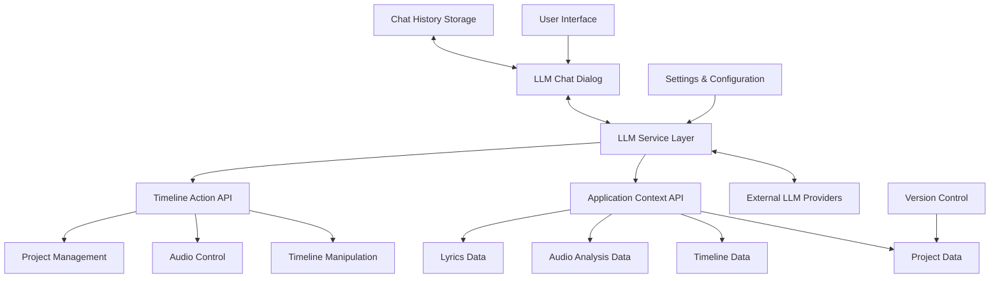

# Comprehensive LLM Integration Plan for Sequence Maker

## 1. Architecture Overview



## 2. Key Components

### 2.1. LLM Service Layer
- **Purpose**: Abstract communication with different LLM providers
- **Key Features**:
  - Support for multiple providers (OpenAI, Claude, local models)
  - Token usage tracking and cost estimation
  - Configurable model parameters

### 2.2. Application Context API
- **Purpose**: Provide structured access to application state
- **Key Features**:
  - Timeline data access (segments, colors, effects)
  - Audio analysis data (beats, tempo, waveform)
  - Lyrics data (words, timestamps)
  - Project metadata

### 2.3. Timeline Action API
- **Purpose**: Allow LLM to manipulate timelines
- **Key Features**:
  - Create/modify/delete segments
  - Set colors and effects
  - Synchronize with audio beats
  - Batch operations

### 2.4. Enhanced LLM Chat Dialog
- **Purpose**: Provide user interface for LLM interaction
- **Key Features**:
  - Persistent chat history
  - User confirmation modes
  - Progress indicators
  - Interruption mechanism

### 2.5. Version Control System
- **Purpose**: Ensure safety and reliability
- **Key Features**:
  - Automatic versioning before/after LLM operations
  - Integration with undo/redo system
  - Named checkpoints

## 3. Implementation Plan

### 3.1. Phase 1: Core LLM Service and Timeline Manipulation (Priority)

#### 3.1.1. Enhance LLMManager Class
```python
# sequence_maker/managers/llm_manager.py

class LLMManager(QObject):
    """
    Manages integration with language models.
    
    Signals:
        llm_response_received: Emitted when a response is received from the LLM.
        llm_error: Emitted when an error occurs during LLM communication.
        llm_thinking: Emitted when the LLM is processing a request.
        llm_ready: Emitted when the LLM is ready for a new request.
        llm_action_requested: Emitted when the LLM requests an action.
        token_usage_updated: Emitted when token usage is updated.
    """
    
    # Add new signals
    llm_action_requested = pyqtSignal(str, dict)  # action_type, parameters
    token_usage_updated = pyqtSignal(int, float)  # tokens, cost
    
    def __init__(self, app):
        # Existing initialization...
        
        # Add token tracking
        self.token_usage = 0
        self.estimated_cost = 0.0
        self.token_prices = {
            "openai": {
                "gpt-3.5-turbo": 0.0015,  # per 1K tokens
                "gpt-4": 0.03,  # per 1K tokens
            },
            "anthropic": {
                "claude-2": 0.01,  # per 1K tokens
                "claude-instant": 0.0025,  # per 1K tokens
            }
        }
        
        # Add action handlers
        self.action_handlers = {}
        
    def register_action_handler(self, action_type, handler):
        """
        Register a handler for a specific action type.
        
        Args:
            action_type (str): Action type.
            handler (callable): Function to handle the action.
        """
        self.action_handlers[action_type] = handler
    
    def track_token_usage(self, response):
        """Track token usage and cost from API response."""
        # Implementation details...
        
    def parse_actions(self, response_text):
        """
        Parse actions from LLM response.
        
        Args:
            response_text (str): LLM response text.
        
        Returns:
            list: List of action objects.
        """
        actions = []
        
        # Look for JSON blocks in the response
        json_blocks = self._extract_json_blocks(response_text)
        
        for json_block in json_blocks:
            try:
                data = json.loads(json_block)
                
                # Check if it's a valid action
                if "action" in data and "parameters" in data:
                    actions.append(data)
            except:
                continue
        
        return actions
    
    def execute_action(self, action_type, parameters):
        """
        Execute an action.
        
        Args:
            action_type (str): Action type.
            parameters (dict): Action parameters.
        
        Returns:
            dict: Result of the action.
        """
        if action_type in self.action_handlers:
            return self.action_handlers[action_type](parameters)
        else:
            self.logger.warning(f"No handler for action type: {action_type}")
            return {"success": False, "error": f"Unknown action type: {action_type}"}
```

#### 3.1.2. Create TimelineActionAPI Class
```python
# sequence_maker/api/timeline_action_api.py

class TimelineActionAPI:
    """
    Provides an API for LLM to manipulate timelines.
    """
    
    def __init__(self, app):
        """
        Initialize the timeline action API.
        
        Args:
            app: The main application instance.
        """
        self.app = app
        self.logger = logging.getLogger("SequenceMaker.TimelineActionAPI")
        
        # Register action handlers
        self.app.llm_manager.register_action_handler("create_segment", self.create_segment)
        self.app.llm_manager.register_action_handler("modify_segment", self.modify_segment)
        self.app.llm_manager.register_action_handler("delete_segment", self.delete_segment)
        self.app.llm_manager.register_action_handler("set_default_color", self.set_default_color)
        self.app.llm_manager.register_action_handler("add_effect", self.add_effect)
    
    def create_segment(self, parameters):
        """
        Create a new segment in a timeline.
        
        Args:
            parameters (dict): Parameters for the action.
                - timeline_index (int): Timeline index.
                - start_time (float): Start time in seconds.
                - end_time (float): End time in seconds.
                - color (list): RGB color list [r, g, b].
                - pixels (int, optional): Number of pixels.
        
        Returns:
            dict: Result of the operation.
        """
        try:
            # Save state for undo
            if self.app.undo_manager:
                self.app.undo_manager.save_state("llm_create_segment")
            
            # Extract parameters
            timeline_index = parameters.get("timeline_index")
            start_time = parameters.get("start_time")
            end_time = parameters.get("end_time")
            color = parameters.get("color")
            pixels = parameters.get("pixels")
            
            # Validate parameters
            if timeline_index is None or start_time is None or end_time is None or color is None:
                return {"success": False, "error": "Missing required parameters"}
            
            # Get timeline
            timeline = self.app.timeline_manager.get_timeline(timeline_index)
            if not timeline:
                return {"success": False, "error": f"Timeline {timeline_index} not found"}
            
            # Convert color list to tuple
            color_tuple = tuple(color)
            
            # Create segment
            segment = self.app.timeline_manager.add_segment(
                timeline=timeline,
                start_time=start_time,
                end_time=end_time,
                color=color_tuple,
                pixels=pixels
            )
            
            if segment:
                return {
                    "success": True,
                    "segment": {
                        "start_time": segment.start_time,
                        "end_time": segment.end_time,
                        "color": list(segment.color),
                        "pixels": segment.pixels
                    }
                }
            else:
                return {"success": False, "error": "Failed to create segment"}
        
        except Exception as e:
            self.logger.error(f"Error creating segment: {e}")
            return {"success": False, "error": str(e)}
```

## 4. Implementation Timeline

### Week 1: Core LLM Service and Timeline Manipulation
- Enhance LLMManager with action handling
- Create TimelineActionAPI
- Create AppContextAPI
- Basic integration testing

### Week 2: Enhanced LLM Chat Dialog with Persistence
- Extend Project model for chat history
- Enhance LLMChatDialog with confirmation modes
- Implement chat history persistence
- User testing and refinement

### Week 3: Settings Integration and Version Control
- Extend Settings Dialog with LLM options
- Implement token tracking and cost estimation
- Enhance UndoManager for LLM operations
- Testing and documentation

### Week 4: Audio Analysis Integration and Final Polishing
- Enhance AudioManager with advanced analysis
- Integrate audio analysis with LLM context
- Final testing and bug fixes
- Documentation and user guide

## 5. Key Considerations and Best Practices

### 5.1. Security
- Store API keys securely (encrypted when possible)
- Validate all LLM-generated actions before execution
- Implement proper error handling for all API calls

### 5.2. Performance
- Use asynchronous processing for LLM requests
- Optimize context generation to minimize token usage
- Cache analysis results when possible

### 5.3. User Experience
- Provide clear feedback during LLM operations
- Ensure all LLM actions are undoable
- Maintain consistent UI responsiveness

### 5.4. Extensibility
- Design for easy addition of new LLM providers
- Create a plugin architecture for new LLM actions
- Document APIs for future extensions

## 6. Testing Strategy

### 6.1. Unit Tests
- Test each API method in isolation
- Mock LLM responses for predictable testing
- Verify error handling and edge cases

### 6.2. Integration Tests
- Test the full LLM workflow with mock providers
- Verify context generation and action execution
- Test persistence of chat history

### 6.3. User Acceptance Testing
- Test with real LLM providers
- Verify all user confirmation modes
- Test with various audio files and timelines
