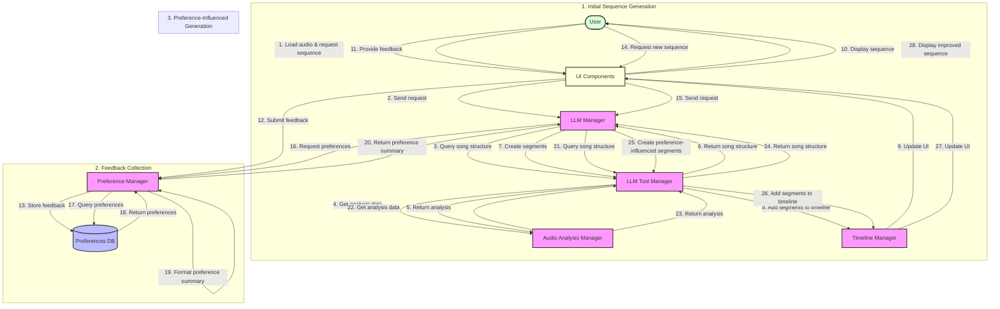

# Preference Learning System: Data Flow Diagram

The following diagram illustrates the complete data flow in the preference learning system, from initial sequence generation to feedback collection, storage, retrieval, and influence on future generations.



## Detailed Data Flow Explanation

### 1. Initial Sequence Generation

1. **User Initiates Request**: The user loads an audio file and requests a color sequence generation.
2. **UI Sends Request**: The UI forwards this request to the LLM Manager.
3. **LLM Queries Song Structure**: The LLM uses the Tool Manager to get information about the song.
4. **Tool Manager Gets Analysis**: The Tool Manager requests analysis data from the Audio Analysis Manager.
5. **Analysis Data Returned**: The Audio Analysis Manager returns the song analysis (beats, sections, etc.).
6. **Song Structure Returned**: The Tool Manager returns the structured song data to the LLM.
7. **LLM Creates Segments**: The LLM decides on patterns and calls the Tool Manager to create segments.
8. **Segments Added to Timeline**: The Tool Manager adds the segments to the Timeline Manager.
9. **UI Updated**: The Timeline Manager updates the UI with the new segments.
10. **Sequence Displayed**: The UI displays the generated sequence to the user.

### 2. Feedback Collection

11. **User Provides Feedback**: The user provides feedback on the generated sequence.
12. **Feedback Submitted**: The UI submits this feedback to the Preference Manager.
13. **Feedback Stored**: The Preference Manager stores the feedback in the Preferences Database.

### 3. Preference-Influenced Generation

14. **User Requests New Sequence**: The user requests a new or revised sequence.
15. **UI Sends Request**: The UI forwards this request to the LLM Manager.
16. **LLM Requests Preferences**: The LLM Manager requests relevant preferences from the Preference Manager.
17. **Preferences Queried**: The Preference Manager queries the Preferences Database.
18. **Preferences Returned**: The database returns relevant preference records.
19. **Preferences Formatted**: The Preference Manager formats the preferences into a summary.
20. **Preference Summary Returned**: The formatted preference summary is returned to the LLM Manager.
21. **LLM Queries Song Structure**: The LLM uses the Tool Manager to get information about the song.
22. **Tool Manager Gets Analysis**: The Tool Manager requests analysis data from the Audio Analysis Manager.
23. **Analysis Data Returned**: The Audio Analysis Manager returns the song analysis.
24. **Song Structure Returned**: The Tool Manager returns the structured song data to the LLM.
25. **LLM Creates Preference-Influenced Segments**: The LLM creates segments influenced by the preference summary.
26. **Segments Added to Timeline**: The Tool Manager adds the segments to the Timeline Manager.
27. **UI Updated**: The Timeline Manager updates the UI with the new segments.
28. **Improved Sequence Displayed**: The UI displays the improved sequence to the user.

## Data Structures

### Preference Record

```json
{
  "id": 1,
  "song_identifier": "path/to/song.mp3",
  "feedback_text": "I loved the blue pulses on the beats during the chorus",
  "sentiment": 1,
  "tags": ["chorus", "pulse", "blue", "beat_sync"],
  "created_at": "2025-03-27T10:15:00"
}
```

### Preference Summary

```
User Preference Summary (Apply these guidelines where appropriate):
- Song-specific preferences:
  - Likes: Blue pulses on beats during the chorus
  - Dislikes: Abrupt color transitions between sections
- General preferences:
  - Likes: Slow color fades during verses
  - Prefers: Using brighter colors for high-energy sections
```

### LLM System Message with Preferences

```
User Preference Summary (Apply these guidelines where appropriate):
- Song-specific preferences:
  - Likes: Blue pulses on beats during the chorus
  - Dislikes: Abrupt color transitions between sections
- General preferences:
  - Likes: Slow color fades during verses
  - Prefers: Using brighter colors for high-energy sections

Original System Prompt:
You are a creative assistant that helps design color sequences for juggling balls...
```

This diagram and explanation illustrate how the preference learning system creates a continuous feedback loop, allowing the system to learn from user preferences and improve its sequence generation over time.