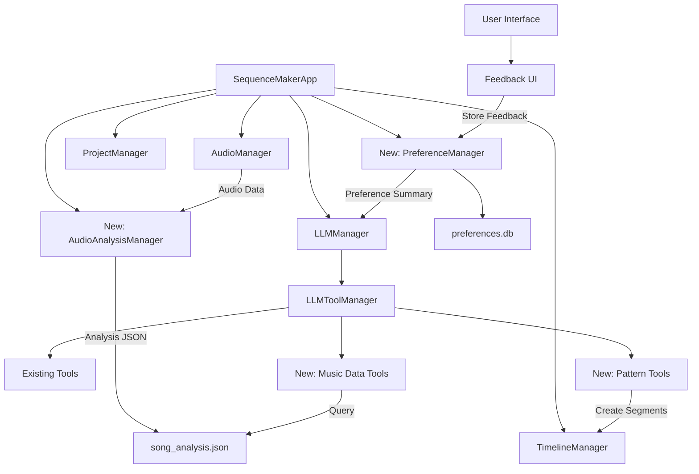

# Music Analysis and LLM Integration: Complete Architecture Plan

This document provides a comprehensive architecture plan for implementing music analysis and LLM preference learning features in the Sequence Maker application.

## Overview

The implementation consists of several key components:

1. **AudioAnalysisManager**: Analyzes audio files using librosa and stores results in JSON format
2. **PreferenceManager**: Stores and retrieves user feedback to guide future LLM designs
3. **New LLM Tools**: Extensions to the existing LLM tool system for music data access and pattern creation
4. **UI Integration**: Components for collecting user feedback

## Architecture Diagram

## Detailed Documentation

The complete architecture plan is split across multiple files for better organization:

1. **Core Architecture and Components**: 
   - `music_analysis_llm_integration_plan.md` - Contains the initial architecture plan
   - `music_analysis_llm_integration_plan_completion.md` - Contains implementation details and integration steps

2. **Preference Learning System**:
   - `preference_learning_mechanism_details.md` - Detailed explanation of the preference learning mechanism
   - `preference_learning_dataflow_diagram.md` - Visual data flow diagram for the preference learning system

## Implementation Summary

### New Components

1. **AudioAnalysisManager**
   - Analyzes audio using librosa to extract beats, sections, energy, etc.
   - Stores results in a structured JSON format
   - Provides tools for accessing analysis data

2. **PreferenceManager**
   - Stores user feedback in SQLite database
   - Retrieves and summarizes relevant preferences
   - Provides preference summaries to the LLM

### New LLM Tools

1. **Music Data Tools**
   - `get_song_metadata`: Get general song information
   - `get_beats_in_range`: Get beat timestamps in a time range
   - `get_section_details`: Get details about a specific section
   - `get_feature_value_at_time`: Get musical feature values at a specific time

2. **Pattern Tools**
   - `apply_beat_pattern`: Apply rhythmic patterns synchronized to beats
   - `apply_section_theme`: Apply consistent themes to sections with energy modulation

### Integration Points

1. **Application Initialization**
   - Add new managers to `_init_managers` method in `application.py`

2. **LLM Manager Integration**
   - Modify `send_request` method to include preference summary

3. **UI Integration**
   - Add feedback UI elements to LLM chat dialog

## Implementation Steps

1. Create the AudioAnalysisManager
2. Create the PreferenceManager
3. Add new LLM tools
4. Integrate with existing components
5. Add UI elements for feedback collection
6. Test the implementation

## Next Steps

To implement this architecture:

1. Review the detailed documentation in the referenced files
2. Implement the components in the specified order
3. Test each component individually
4. Test the integrated system

This architecture provides a comprehensive solution for integrating music analysis and LLM preference learning into the Sequence Maker application, enabling sophisticated music-synchronized juggling patterns that adapt to user preferences over time.
