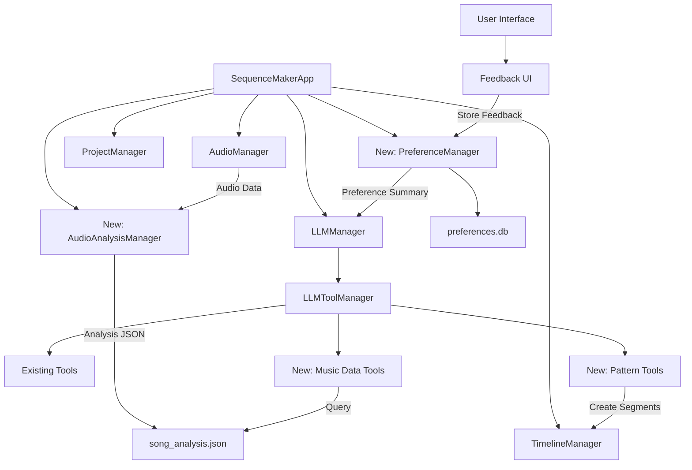

# Music Analysis and LLM Integration Architecture Plan

After analyzing the Sequence Maker codebase, I've developed a comprehensive architecture plan to implement the music analysis and LLM preference learning features. This plan builds on the existing architecture while adding new components to enable sophisticated music-driven juggling ball color sequences.

## 1. System Overview



## 2. New Components

### 2.1 AudioAnalysisManager

**Purpose:** Perform comprehensive audio analysis using librosa and store results in a structured JSON format.

**Location:** `sequence_maker/managers/audio_analysis_manager.py`

**Key Methods:**
- `analyze_audio(audio_file_path)`: Analyzes audio and generates a comprehensive `song_analysis.json`
- `get_analysis_path()`: Returns the path to the current song's analysis JSON
- `load_analysis()`: Loads the analysis data from the JSON file

**Implementation Details:**

```python
class AudioAnalysisManager:
    def __init__(self, app):
        self.app = app
        self.logger = logging.getLogger("SequenceMaker.AudioAnalysisManager")
        self.analysis_cache_dir = Path.home() / ".sequence_maker" / "analysis_cache"
        self.analysis_cache_dir.mkdir(parents=True, exist_ok=True)
        self.current_analysis_path = None
        
    def analyze_audio(self, audio_file_path=None):
        """
        Analyze audio file to extract musical features.
        
        Args:
            audio_file_path: Path to audio file (uses currently loaded audio if None)
            
        Returns:
            dict: Analysis data
        """
        # Use current audio if path not provided
        if audio_file_path is None and hasattr(self.app, 'audio_manager'):
            audio_data = self.app.audio_manager.audio_data
            sample_rate = self.app.audio_manager.sample_rate
            audio_file_path = self.app.audio_manager.audio_file
        else:
            # Load audio using librosa
            audio_data, sample_rate = librosa.load(audio_file_path, sr=None)
        
        # Generate analysis file path based on audio file path
        analysis_path = self._get_analysis_path_for_audio(audio_file_path)
        self.current_analysis_path = analysis_path
        
        # Extract features
        analysis_data = self._extract_features(audio_data, sample_rate)
        
        # Save to JSON
        with open(analysis_path, 'w') as f:
            json.dump(analysis_data, f, indent=2)
            
        return analysis_data
        
    def _extract_features(self, audio_data, sample_rate):
        """Extract musical features from audio data."""
        # Basic features
        duration = librosa.get_duration(y=audio_data, sr=sample_rate)
        tempo, beat_frames = librosa.beat.beat_track(y=audio_data, sr=sample_rate)
        beat_times = librosa.frames_to_time(beat_frames, sr=sample_rate)
        
        # Derive downbeats (assuming 4/4 time signature)
        downbeats = beat_times[::4]  # Every 4th beat
        
        # Segment analysis for section detection
        mfcc = librosa.feature.mfcc(y=audio_data, sr=sample_rate)
        segment_boundaries = librosa.segment.agglomerative(mfcc, 8)  # 8 segments
        segment_times = librosa.frames_to_time(segment_boundaries, sr=sample_rate)
        
        # Create labeled sections
        sections = []
        section_labels = ["Intro", "Verse 1", "Chorus 1", "Verse 2", "Chorus 2", "Bridge", "Chorus 3", "Outro"]
        for i in range(len(segment_times) - 1):
            label = section_labels[i] if i < len(section_labels) else f"Section {i+1}"
            sections.append({
                "label": label,
                "start": float(segment_times[i]),
                "end": float(segment_times[i+1])
            })
        
        # Energy and onset strength
        rms = librosa.feature.rms(y=audio_data)[0]
        onset_env = librosa.onset.onset_strength(y=audio_data, sr=sample_rate)
        
        # Spectral features
        chroma = librosa.feature.chroma_stft(y=audio_data, sr=sample_rate)
        spectral_contrast = librosa.feature.spectral_contrast(y=audio_data, sr=sample_rate)
        
        # Convert numpy arrays to lists for JSON serialization
        times = librosa.times_like(rms, sr=sample_rate)
        
        # Create analysis data structure
        return {
            "song_title": os.path.basename(audio_file_path) if audio_file_path else "Unknown",
            "duration_seconds": float(duration),
            "estimated_tempo": float(tempo),
            "time_signature_guess": "4/4",
            "beats": [float(t) for t in beat_times],
            "downbeats": [float(t) for t in downbeats],
            "sections": sections,
            "energy_timeseries": {
                "times": [float(t) for t in times],
                "values": [float(v) for v in rms]
            },
            "onset_strength_timeseries": {
                "times": [float(t) for t in librosa.times_like(onset_env, sr=sample_rate)],
                "values": [float(v) for v in onset_env]
            },
            "chroma_features": {
                "times": [float(t) for t in librosa.times_like(chroma, sr=sample_rate)],
                "values": [[float(v) for v in row] for row in chroma]
            },
            "spectral_contrast": {
                "times": [float(t) for t in librosa.times_like(spectral_contrast, sr=sample_rate)],
                "values": [[float(v) for v in row] for row in spectral_contrast]
            }
        }
        
    def _get_analysis_path_for_audio(self, audio_file_path):
        """Generate a path for the analysis JSON based on the audio file path."""
        if not audio_file_path:
            return self.analysis_cache_dir / "unknown_audio_analysis.json"
            
        # Create a hash of the audio path to use as filename
        import hashlib
        path_hash = hashlib.md5(audio_file_path.encode()).hexdigest()
        return self.analysis_cache_dir / f"{path_hash}_analysis.json"
        
    def get_analysis_path(self):
        """Get the path to the current analysis JSON."""
        return self.current_analysis_path
        
    def load_analysis(self):
        """Load the current analysis data from JSON."""
        if not self.current_analysis_path or not os.path.exists(self.current_analysis_path):
            # Try to analyze current audio if available
            if hasattr(self.app, 'audio_manager') and self.app.audio_manager.audio_file:
                return self.analyze_audio()
            return None
            
        try:
            with open(self.current_analysis_path, 'r') as f:
                return json.load(f)
        except Exception as e:
            self.logger.error(f"Error loading analysis data: {e}")
            return None
```

### 2.2 PreferenceManager

**Purpose:** Store and retrieve user feedback on generated sequences to guide future LLM designs.

**Location:** `sequence_maker/managers/preference_manager.py`

**Key Methods:**
- `add_feedback(song_identifier, feedback_text, sentiment, tags=None)`: Store user feedback
- `get_preference_summary(song_identifier, max_items=5)`: Get a summary of relevant preferences

**Implementation Details:**

```python
import sqlite3
import json
import logging
from datetime import datetime
from pathlib import Path

class PreferenceManager:
    def __init__(self, app):
        self.app = app
        self.logger = logging.getLogger("SequenceMaker.PreferenceManager")
        self.db_path = Path.home() / ".sequence_maker" / "preferences.db"
        self.db_path.parent.mkdir(parents=True, exist_ok=True)
        self._init_db()
        
    def _init_db(self):
        """Initialize the SQLite database."""
        conn = sqlite3.connect(self.db_path)
        cursor = conn.cursor()
        
        # Create preferences table if it doesn't exist
        cursor.execute('''
        CREATE TABLE IF NOT EXISTS preferences (
            id INTEGER PRIMARY KEY AUTOINCREMENT,
            song_identifier TEXT,
            feedback_text TEXT,
            sentiment INTEGER,
            tags TEXT,
            created_at TEXT
        )
        ''')
        
        conn.commit()
        conn.close()
        
    def add_feedback(self, song_identifier, feedback_text, sentiment, tags=None):
        """
        Add user feedback to the database.
        
        Args:
            song_identifier: Identifier for the song (filename or hash)
            feedback_text: User's feedback text
            sentiment: 1 (positive), 0 (neutral), -1 (negative)
            tags: List of tags (e.g., ["beat sync", "color choice"])
            
        Returns:
            bool: Success status
        """
        try:
            conn = sqlite3.connect(self.db_path)
            cursor = conn.cursor()
            
            # Convert tags list to JSON string
            tags_json = json.dumps(tags) if tags else "[]"
            
            # Insert feedback
            cursor.execute(
                "INSERT INTO preferences (song_identifier, feedback_text, sentiment, tags, created_at) VALUES (?, ?, ?, ?, ?)",
                (song_identifier, feedback_text, sentiment, tags_json, datetime.now().isoformat())
            )
            
            conn.commit()
            conn.close()
            return True
            
        except Exception as e:
            self.logger.error(f"Error adding feedback: {e}")
            return False
            
    def get_preference_summary(self, song_identifier, max_items=5):
        """
        Get a summary of preferences for a song.
        
        Args:
            song_identifier: Identifier for the song
            max_items: Maximum number of feedback items to include
            
        Returns:
            str: Formatted preference summary
        """
        try:
            conn = sqlite3.connect(self.db_path)
            cursor = conn.cursor()
            
            # Get song-specific preferences
            cursor.execute(
                "SELECT feedback_text, sentiment, tags FROM preferences WHERE song_identifier = ? ORDER BY created_at DESC LIMIT ?",
                (song_identifier, max_items)
            )
            song_preferences = cursor.fetchall()
            
            # Get general preferences if needed
            if len(song_preferences) < max_items:
                cursor.execute(
                    "SELECT feedback_text, sentiment, tags FROM preferences WHERE song_identifier != ? ORDER BY created_at DESC LIMIT ?",
                    (song_identifier, max_items - len(song_preferences))
                )
                general_preferences = cursor.fetchall()
            else:
                general_preferences = []
                
            conn.close()
            
            # Format the summary
            summary = "User Preference Summary (Apply these guidelines where appropriate):\n"
            
            # Add song-specific preferences
            if song_preferences:
                summary += "- Song-specific preferences:\n"
                for feedback, sentiment, tags_json in song_preferences:
                    sentiment_str = "Likes" if sentiment > 0 else "Dislikes" if sentiment < 0 else "Neutral on"
                    summary += f"  - {sentiment_str}: {feedback}\n"
            
            # Add general preferences
            if general_preferences:
                summary += "- General preferences:\n"
                for feedback, sentiment, tags_json in general_preferences:
                    sentiment_str = "Likes" if sentiment > 0 else "Dislikes" if sentiment < 0 else "Neutral on"
                    summary += f"  - {sentiment_str}: {feedback}\n"
                    
            return summary
            
        except Exception as e:
            self.logger.error(f"Error getting preference summary: {e}")
            return ""
```

## 3. LLM Tool Extensions

### 3.1 New Music Data Tools

**Location:** `sequence_maker/app/llm/tool_manager.py`

**New Tool Definitions:**

```python
# Add to audio_functions property
{
    "name": "get_song_metadata",
    "description": "Retrieves general metadata about the current song, including duration, estimated tempo, and a list of identified sections (like intro, verse, chorus) with their labels and approximate start/end times.",
    "parameters": {
        "type": "object",
        "properties": {}
    }
},
{
    "name": "get_beats_in_range",
    "description": "Fetches the precise timestamps of musical beats within a specified time range (in seconds). Can optionally filter for 'all' beats, only 'downbeats', or potentially other beat subdivisions if analyzed.",
    "parameters": {
        "type": "object",
        "properties": {
            "start_time": {
                "type": "number",
                "description": "Start of the time range in seconds"
            },
            "end_time": {
                "type": "number",
                "description": "End of the time range in seconds"
            },
            "beat_type": {
                "type": "string",
                "description": "Type of beat to retrieve ('all' or 'downbeat')",
                "enum": ["all", "downbeat"]
            }
        },
        "required": ["start_time", "end_time"]
    }
},
{
    "name": "get_section_details",
    "description": "Provides the precise start and end times for a specific section identified by its label (e.g., 'Chorus 1', 'Verse 2'). Use get_song_metadata first to see available section labels.",
    "parameters": {
        "type": "object",
        "properties": {
            "section_label": {
                "type": "string",
                "description": "The label of the section (e.g., 'Chorus 1', 'Verse 2')"
            }
        },
        "required": ["section_label"]
    }
},
{
    "name": "get_feature_value_at_time",
    "description": "Retrieves the estimated value of a specific musical feature (e.g., 'energy', 'onset_strength') at a given point in time.",
    "parameters": {
        "type": "object",
        "properties": {
            "time": {
                "type": "number",
                "description": "The timestamp to query in seconds"
            },
            "feature_name": {
                "type": "string",
                "description": "The feature to retrieve",
                "enum": ["energy", "onset_strength", "chroma", "spectral_contrast"]
            }
        },
        "required": ["time", "feature_name"]
    }
}
```

**Handler Implementations:**

```python
def _handle_get_song_metadata(self, parameters):
    """
    Handle the get_song_metadata action.
    
    Returns:
        dict: Song metadata.
    """
    if not hasattr(self.app, 'audio_analysis_manager'):
        return {"error": "Audio analysis manager not available"}
    
    try:
        # Load analysis data
        analysis_data = self.app.audio_analysis_manager.load_analysis()
        if not analysis_data:
            return {"error": "No audio analysis available"}
        
        # Extract metadata
        return {
            "success": True,
            "song_title": analysis_data["song_title"],
            "duration_seconds": analysis_data["duration_seconds"],
            "estimated_tempo": analysis_data["estimated_tempo"],
            "time_signature_guess": analysis_data["time_signature_guess"],
            "sections": analysis_data["sections"]
        }
    except Exception as e:
        self.logger.error(f"Error in get_song_metadata: {e}")
        return {"error": str(e)}

def _handle_get_beats_in_range(self, parameters):
    """
    Handle the get_beats_in_range action.
    
    Args:
        parameters (dict): Action parameters.
        
    Returns:
        dict: Beats in the specified range.
    """
    if not hasattr(self.app, 'audio_analysis_manager'):
        return {"error": "Audio analysis manager not available"}
    
    try:
        # Extract parameters
        start_time = parameters.get("start_time")
        end_time = parameters.get("end_time")
        beat_type = parameters.get("beat_type", "all")
        
        # Validate parameters
        if start_time is None or end_time is None:
            return {"error": "start_time and end_time are required"}
        
        # Load analysis data
        analysis_data = self.app.audio_analysis_manager.load_analysis()
        if not analysis_data:
            return {"error": "No audio analysis available"}
        
        # Get beats based on beat_type
        if beat_type == "downbeat":
            beats = analysis_data["downbeats"]
        else:  # "all" or any other value
            beats = analysis_data["beats"]
        
        # Filter beats by time range
        filtered_beats = [beat for beat in beats if start_time <= beat < end_time]
        
        return {
            "success": True,
            "beats": filtered_beats,
            "beat_type": beat_type,
            "start_time": start_time,
            "end_time": end_time
        }
    except Exception as e:
        self.logger.error(f"Error in get_beats_in_range: {e}")
        return {"error": str(e)}

def _handle_get_section_details(self, parameters):
    """
    Handle the get_section_details action.
    
    Args:
        parameters (dict): Action parameters.
        
    Returns:
        dict: Section details.
    """
    if not hasattr(self.app, 'audio_analysis_manager'):
        return {"error": "Audio analysis manager not available"}
    
    try:
        # Extract parameters
        section_label = parameters.get("section_label")
        
        # Validate parameters
        if not section_label:
            return {"error": "section_label is required"}
        
        # Load analysis data
        analysis_data = self.app.audio_analysis_manager.load_analysis()
        if not analysis_data:
            return {"error": "No audio analysis available"}
        
        # Find section by label
        section = None
        for s in analysis_data["sections"]:
            if s["label"] == section_label:
                section = s
                break
        
        if not section:
            return {"error": f"Section '{section_label}' not found"}
        
        return {
            "success": True,
            "label": section["label"],
            "start": section["start"],
            "end": section["end"]
        }
    except Exception as e:
        self.logger.error(f"Error in get_section_details: {e}")
        return {"error": str(e)}

def _handle_get_feature_value_at_time(self, parameters):
    """
    Handle the get_feature_value_at_time action.
    
    Args:
        parameters (dict): Action parameters.
        
    Returns:
        dict: Feature value at the specified time.
    """
    if not hasattr(self.app, 'audio_analysis_manager'):
        return {"error": "Audio analysis manager not available"}
    
    try:
        # Extract parameters
        time = parameters.get("time")
        feature_name = parameters.get("feature_name")
        
        # Validate parameters
        if time is None:
            return {"error": "time is required"}
        if not feature_name:
            return {"error": "feature_name is required"}
        
        # Load analysis data
        analysis_data = self.app.audio_analysis_manager.load_analysis()
        if not analysis_data:
            return {"error": "No audio analysis available"}
        
        # Get feature data
        if feature_name == "energy":
            feature_data = analysis_data["energy_timeseries"]
        elif feature_name == "onset_strength":
            feature_data = analysis_data["onset_strength_timeseries"]
        elif feature_name == "chroma":
            feature_data = analysis_data["chroma_features"]
        elif feature_name == "spectral_contrast":
            feature_data = analysis_data["spectral_contrast"]
        else:
            return {"error": f"Unknown feature: {feature_name}"}
        
        # Find closest time index
        times = feature_data["times"]
        closest_idx = min(range(len(times)), key=lambda i: abs(times[i] - time))
        
        # Get value at that time
        if feature_name in ["chroma", "spectral_contrast"]:
            # These are multi-dimensional features
            value = [row[closest_idx] for row in feature_data["values"]]
        else:
            value = feature_data["values"][closest_idx]
        
        return {
            "success": True,
            "time": time,
            "feature": feature_name,
            "value": value,
            "actual_time": times[closest_idx]
        }
    except Exception as e:
        self.logger.error(f"Error in get_feature_value_at_time: {e}")
        return {"error": str(e)}
```

### 3.2 Higher-Level Pattern Tools

**New Tool Definitions:**

```python
# Add to timeline_functions property
{
    "name": "apply_beat_pattern",
    "description": "Applies a rhythmic color pattern synchronized to beats within a given section or time range.",
    "parameters": {
        "type": "object",
        "properties": {
            "section_label": {
                "type": "string",
                "description": "Label of the section to apply the pattern to (e.g., 'Chorus 1'). Use either section_label OR start_time and end_time."
            },
            "start_time": {
                "type": "number",
                "description": "Start time in seconds. Use with end_time if not using section_label."
            },
            "end_time": {
                "type": "number",
                "description": "End time in seconds. Use with start_time if not using section_label."
            },
            "beat_type": {
                "type": "string",
                "description": "Type of beat to synchronize with ('all' or 'downbeat')",
                "enum": ["all", "downbeat"]
            },
            "pattern_type": {
                "type": "string",
                "description": "Type of pattern to apply",
                "enum": ["pulse", "toggle", "fade_in", "fade_out"]
            },
            "color": {
                "oneOf": [
                    {
                        "type": "array",
                        "description": "RGB color values (0-255)",
                        "items": {
                            "type": "integer",
                            "minimum": 0,
                            "maximum": 255
                        },
                        "minItems": 3,
                        "maxItems": 3
                    },
                    {
                        "type": "string",
                        "description": "Color name (e.g., 'red', 'green', 'blue', etc.)"
                    }
                ],
                "description": "The RGB color ([R, G, B]) or color name for the pattern"
            },
            "balls": {
                "oneOf": [
                    {
                        "type": "array",
                        "description": "List of ball indices",
                        "items": {
                            "type": "integer",
                            "minimum": 0
                        }
                    },
                    {
                        "type": "string",
                        "enum": ["all"],
                        "description": "Apply to all balls"
                    }
                ],
                "description": "A list of ball indices or 'all' to apply the pattern to"
            },
            "pulse_duration": {
                "type": "number",
                "description": "Duration of each pulse in seconds (for 'pulse' pattern type)",
                "minimum": 0.01,
                "maximum": 1.0
            }
        },
        "required": ["pattern_type", "color", "balls"]
    }
},
{
    "name": "apply_section_theme",
    "description": "Applies a consistent color theme to a section, potentially modulating brightness or saturation based on the song's energy/loudness within that section.",
    "parameters": {
        "type": "object",
        "properties": {
            "section_label": {
                "type": "string",
                "description": "Label of the section to apply the theme to (e.g., 'Chorus 1')"
            },
            "base_color": {
                "oneOf": [
                    {
                        "type": "array",
                        "description": "RGB color values (0-255)",
                        "items": {
                            "type": "integer",
                            "minimum": 0,
                            "maximum": 255
                        },
                        "minItems": 3,
                        "maxItems": 3
                    },
                    {
                        "type": "string",
                        "description": "Color name (e.g., 'red', 'green', 'blue', etc.)"
                    }
                ],
                "description": "The base RGB color ([R, G, B]) or color name for the section"
            },
            "energy_map": {
                "type": "string",
                "description": "How to map energy to color properties",
                "enum": ["brightness", "saturation", "none"]
            },
            "balls": {
                "oneOf": [
                    {
                        "type": "array",
                        "description": "List of ball indices",
                        "items": {
                            "type": "integer",
                            "minimum": 0
                        }
                    },
                    {
                        "type": "string",
                        "enum": ["all"],
                        "description": "Apply to all balls"
                    }
                ],
                "description": "A list of ball indices or 'all' to apply the theme to"
            }
        },
        "required": ["section_label", "base_color", "balls"]
    }
}
```

**Handler Implementation:**

```python
def _handle_apply_beat_pattern(self, parameters):
    """
    Handle the apply_beat_pattern action.
    
    Args:
        parameters (dict): Action parameters.
        
    Returns:
        dict: Result of the action.
    """
    try:
        # Extract parameters
        section_label = parameters.get("section_label")
        start_time = parameters.get("start_time")
        end_time = parameters.get("end_time")
        beat_type = parameters.get("beat_type", "all")
        pattern_type = parameters.get("pattern_type")
        color_input = parameters.get("color")
        balls_input = parameters.get("balls")
        pulse_duration = parameters.get("pulse_duration", 0.1)
        
        # Resolve color
        color = self._resolve_color_name(color_input)
        
        # Resolve balls
        if balls_input == "all":
            balls = list(range(len(self.app.project_manager.current_project.timelines)))
        else:
            balls = balls_input
        
        # Get time range from section if provided
        if section_label and not (start_time and end_time):
            section_result = self._handle_get_section_details({"section_label": section_label})
            if "error" in section_result:
                return section_result
            
            start_time = section_result["start"]
            end_time = section_result["end"]
        
        # Get beats in the time range
        beats_result = self._handle_get_beats_in_range({
            "start_time": start_time,
            "end_time": end_time,
            "beat_type": beat_type
        })
        
        if "error" in beats_result:
            return beats_result
        
        beats = beats_result["beats"]
        
        # Create segments based on pattern type
        segments_created = 0
        
        for ball_index in balls:
            if pattern_type == "pulse":
                # Create a short pulse on each beat
                for beat_time in beats:
                    # Create segment for the pulse
                    pulse_end = min(beat_time + pulse_duration, end_time)
                    self.app.timeline_manager.create_segment(
                        ball_index, beat_time, pulse_end, color
                    )
                    segments_created += 1
                    
            elif pattern_type == "toggle":
                # Toggle between color and off on each beat
                is_on = True
                prev_time = start_time
                
                for beat_time in beats:
                    if is_on:
                        # Create colored segment
                        self.app.timeline_manager.create_segment(
                            ball_index, prev_time, beat_time, color
                        )
                    else:
                        # Create "off" segment (black)
                        self.app.timeline_manager.create_segment(
                            ball_index, prev_time, beat_time, [0, 0, 0]
                        )
                    
                    prev_time = beat_time
                    is_on = not is_on
                    segments_created += 1
                
                # Handle final segment to end_time
                if prev_time < end_time:
                    if is_on:
                        self.app.timeline_manager.create_segment(
                            ball_index, prev_time, end_time, color
                        )
                    else:
                        self.app.timeline_manager.create_segment(
                            ball_index, prev_time, end_time, [0, 0, 0]
                        )
                    segments_created += 1
            
            elif pattern_type == "fade_in":
                # Create a gradual fade-in effect
                # Divide the section into small segments
                num_segments = 10
                segment_duration = (end_time - start_time) / num_segments
                
                for i in range(num_segments):
                    segment_start = start_time + i * segment_duration
                    segment_end = segment_start + segment_duration
                    
                    # Calculate brightness factor (0.0 to 1.0)
                    brightness = i / (num_segments - 1)
                    
                    # Adjust color brightness
                    segment_color = [int(c * brightness) for c in color]
                    
