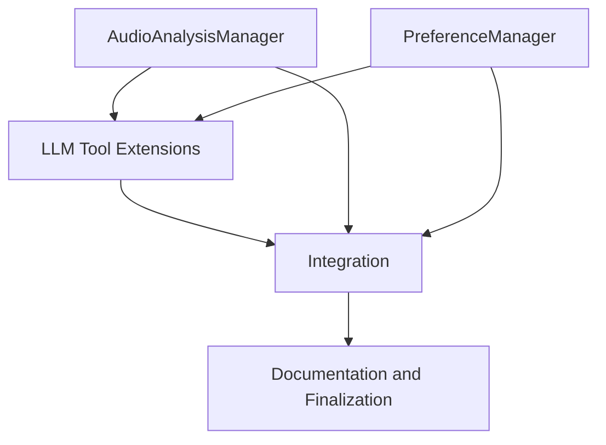
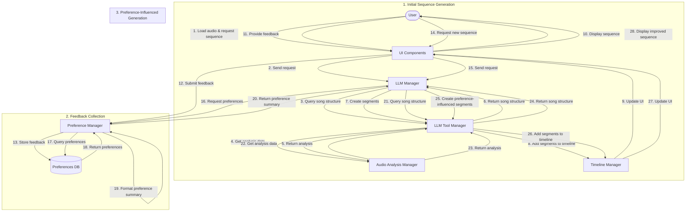

# Music Analysis LLM Integration: Todo List

This document outlines the detailed tasks required to implement the music analysis and LLM preference learning features in the Sequence Maker application. Tasks are organized by component with dependencies noted where applicable.

## 1. AudioAnalysisManager

### Setup and Basic Structure
1. ✅ **Create AudioAnalysisManager class skeleton**
   - ✅ Create file `sequence_maker/managers/audio_analysis_manager.py`
   - ✅ Implement basic class structure with initialization
   - ✅ Set up logging and cache directory creation

2. ✅ **Implement analysis path management**
   - ✅ Add `_get_analysis_path_for_audio` method to generate paths for analysis files
   - ✅ Add `get_analysis_path` method to retrieve current analysis path
   - ✅ Ensure proper caching mechanism for analysis results

### Core Analysis Functionality
3. ✅ **Implement audio loading functionality**
   - ✅ Add code to load audio data from file or use currently loaded audio
   - ✅ Handle different audio formats and sampling rates
   - ✅ *Dependency: Task 1*

4. ✅ **Implement basic feature extraction**
   - ✅ Add `_extract_features` method with basic audio analysis (tempo, beats, duration)
   - ✅ Implement beat and downbeat detection
   - ✅ *Dependency: Task 3*

5. ✅ **Implement advanced feature extraction**
   - ✅ Add code for section detection and labeling
   - ✅ Add energy and onset strength analysis
   - ✅ Add spectral feature extraction (chroma, spectral contrast)
   - ✅ *Dependency: Task 4*

6. ✅ **Implement main analysis method**
   - ✅ Complete `analyze_audio` method to orchestrate the analysis process
   - ✅ Add JSON serialization of analysis results
   - ✅ *Dependencies: Tasks 2, 5*

7. ✅ **Implement analysis loading**
   - ✅ Add `load_analysis` method to load existing analysis or trigger new analysis
   - ✅ Add error handling for missing or corrupt analysis files
   - ✅ *Dependency: Task 6*

### Testing
8. ✅ **Create unit tests for AudioAnalysisManager**
   - ✅ Test path generation and caching
   - ✅ Test feature extraction with sample audio files
   - ✅ Test loading and saving analysis data
   - ✅ *Dependencies: Tasks 1-7*

## 2. PreferenceManager

### Setup and Basic Structure
9. ✅ **Create PreferenceManager class skeleton**
   - ✅ Create file `sequence_maker/managers/preference_manager.py`
   - ✅ Implement basic class structure with initialization
   - ✅ Set up logging and database path creation
   - ✅ Implement according to `preference_learning_mechanism_details.md`

10. ✅ **Implement database initialization**
    - ✅ Add `_init_db` method to create SQLite database and tables
    - ✅ Define schema for preferences table as specified in `preference_learning_mechanism_details.md`
    - ✅ *Dependency: Task 9*

### Core Functionality
11. ✅ **Implement feedback storage**
    - ✅ Add `add_feedback` method to store user feedback
    - ✅ Handle sentiment values and tags
    - ✅ Add error handling for database operations
    - ✅ Implement according to the example in `preference_learning_mechanism_details.md`
    - ✅ *Dependency: Task 10*

12. ✅ **Implement preference retrieval**
    - ✅ Add `get_preference_summary` method to retrieve and format preferences
    - ✅ Implement logic to get song-specific and general preferences
    - ✅ Format preferences into a summary for LLM consumption
    - ✅ Follow the format specified in `preference_learning_dataflow_diagram.md`
    - ✅ *Dependency: Task 11*

### Testing
13. ✅ **Create unit tests for PreferenceManager**
    - ✅ Test database initialization
    - ✅ Test adding and retrieving feedback
    - ✅ Test preference summary formatting
    - ✅ *Dependencies: Tasks 9-12*

## 3. LLM Tool Extensions

### Music Data Tools
14. ✅ **Define music data tool schemas**
    - ✅ Add tool definitions for `get_song_metadata`, `get_beats_in_range`, `get_section_details`, and `get_feature_value_at_time`
    - ✅ Update tool manager to include these new tools
    - ✅ *Dependencies: Tasks 7, 8*

15. ✅ **Implement get_song_metadata handler**
    - ✅ Add `_handle_get_song_metadata` method to retrieve general song information
    - ✅ Connect to AudioAnalysisManager to get analysis data
    - ✅ *Dependencies: Task 14, Task 7*

16. ✅ **Implement get_beats_in_range handler**
    - ✅ Add `_handle_get_beats_in_range` method to retrieve beat timestamps
    - ✅ Add filtering by time range and beat type
    - ✅ *Dependencies: Task 15*

17. ✅ **Implement get_section_details handler**
    - ✅ Add `_handle_get_section_details` method to retrieve section information
    - ✅ Add section lookup by label
    - ✅ *Dependencies: Task 16*

18. ✅ **Implement get_feature_value_at_time handler**
    - ✅ Add `_handle_get_feature_value_at_time` method to retrieve feature values
    - ✅ Add support for different feature types (energy, onset_strength, chroma, spectral_contrast)
    - ✅ Add time-based lookup and interpolation
    - ✅ *Dependencies: Task 17*

### Pattern Tools
19. ✅ **Define pattern tool schemas**
    - ✅ Add tool definitions for `apply_beat_pattern` and `apply_section_theme`
    - ✅ Update tool manager to include these new tools
    - ✅ *Dependencies: Task 18*

20. ✅ **Implement color resolution helper**
    - ✅ Add `_resolve_color_name` method to convert color names to RGB values
    - ✅ Support both RGB arrays and color names
    - ✅ *Dependencies: Task 19*

21. ✅ **Implement apply_beat_pattern handler - Part 1**
    - ✅ Add `_handle_apply_beat_pattern` method with parameter extraction
    - ✅ Implement section and time range resolution
    - ✅ Implement beat retrieval
    - ✅ *Dependencies: Task 20, Task 16*

22. ✅ **Implement apply_beat_pattern handler - Part 2**
    - ✅ Add "pulse" pattern implementation
    - ✅ Add "toggle" pattern implementation
    - ✅ *Dependencies: Task 21*

23. ✅ **Implement apply_beat_pattern handler - Part 3**
    - ✅ Add "fade_in" pattern implementation
    - ✅ Add "fade_out" pattern implementation
    - ✅ *Dependencies: Task 22*

24. ✅ **Implement apply_section_theme handler**
    - ✅ Add `_handle_apply_section_theme` method with parameter extraction
    - ✅ Implement energy-based color modulation
    - ✅ Add support for brightness and saturation mapping
    - ✅ *Dependencies: Task 23, Task 17, Task 18*

### Testing
25. ✅ **Create unit tests for music data tools**
    - ✅ Test each handler with various parameters
    - ✅ Test error handling and edge cases
    - ✅ *Dependencies: Tasks 14-18*

26. ✅ **Create unit tests for pattern tools**
    - ✅ Test each pattern type with various parameters
    - ✅ Test color resolution and energy mapping
    - ✅ *Dependencies: Tasks 19-24*

## 4. Integration

### Application Integration
27. ✅ **Update application initialization**
    - ✅ Modify `_init_managers` method in `application.py` to initialize new managers
    - ✅ Add proper manager initialization order
    - ✅ *Dependencies: Tasks 8, 13*

28. ✅ **Integrate with LLM Manager**
    - ✅ Modify `send_request` method in `llm_manager.py` to include preference summaries
    - ✅ Add logic to retrieve and format preferences
    - ✅ Follow the implementation in `preference_learning_mechanism_details.md`
    - ✅ *Dependencies: Task 27, Task 12*

### UI Integration
29. **Create feedback UI elements**
    - Add feedback group box to LLM chat dialog
    - Add text field for feedback entry
    - Add sentiment buttons (like, neutral, dislike)
    - Implement according to the UI design in `preference_learning_mechanism_details.md`
    - *Dependencies: Task 28*

30. **Implement feedback submission**
    - Add `_submit_feedback` method to handle feedback submission
    - Connect UI elements to PreferenceManager
    - Add user feedback and confirmation
    - *Dependencies: Task 29, Task 11*

### Testing
31. **Test integrated system**
    - Test end-to-end workflow with real audio files
    - Test preference learning and adaptation
    - Verify UI functionality
    - Test the complete feedback loop as described in `preference_learning_dataflow_diagram.md`
    - *Dependencies: Tasks 27-30*

## 5. Documentation and Finalization

32. **Update documentation**
    - Update README with new features
    - Add usage examples for new tools
    - Document preference learning system
    - *Dependencies: Tasks 27-31*

33. **Create user guide**
    - Add instructions for using music analysis features
    - Add guidelines for providing effective feedback
    - Add examples of music-synchronized patterns
    - Include examples from `preference_learning_mechanism_details.md`
    - *Dependencies: Task 32*

34. **Final integration testing**
    - Perform comprehensive testing of all components
    - Verify performance with large audio files
    - Test preference learning over multiple sessions
    - Test the complete feedback loop as described in `preference_learning_dataflow_diagram.md`
    - *Dependencies: Tasks 31-33*

## Dependencies Overview

This diagram shows the high-level dependencies between components:

## Preference Learning Data Flow

The preference learning system creates a continuous feedback loop as described in `preference_learning_dataflow_diagram.md`:

## Task Assignment Strategy

When assigning these tasks to different instances of the assistant, consider the following groupings:

1. **Audio Analysis Specialist**: Tasks 1-8 (AudioAnalysisManager) ✅ COMPLETED
2. **Preference System Developer**: Tasks 9-13 (PreferenceManager)
3. **LLM Tools Developer**: Tasks 14-26 (LLM Tool Extensions)
4. **Integration Specialist**: Tasks 27-31 (Integration)
5. **Documentation Specialist**: Tasks 32-34 (Documentation and Finalization)

Each specialist can work relatively independently once the dependencies from other groups are satisfied.