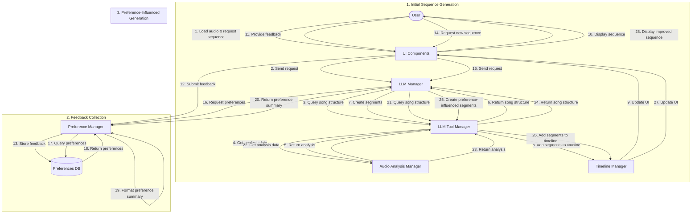

# Preference Learning Integration

This document details how the preference learning system integrates with the music analysis LLM integration plan. It combines information from `preference_learning_dataflow_diagram.md` and `preference_learning_mechanism_details.md` to provide a comprehensive guide for implementation.

## Overview

The preference learning system creates a continuous feedback loop that allows the LLM to adapt to user preferences over time. This system consists of:

1. **Feedback Collection**: UI components for collecting user feedback on generated sequences
2. **Preference Storage**: A database for storing and retrieving user preferences
3. **Preference Integration**: Mechanisms for incorporating preferences into LLM prompts
4. **Adaptive Generation**: LLM-based generation that adapts to user preferences

## Data Flow Diagram

The following diagram illustrates the complete data flow in the preference learning system:



## Implementation Details

### 1. PreferenceManager

The `PreferenceManager` class is responsible for storing and retrieving user preferences:

```python
class PreferenceManager:
    def __init__(self, app):
        self.app = app
        self.logger = logging.getLogger("SequenceMaker.PreferenceManager")
        self.db_path = Path.home() / ".sequence_maker" / "preferences.db"
        self.db_path.parent.mkdir(parents=True, exist_ok=True)
        self._init_db()
        
    def _init_db(self):
        """Initialize the SQLite database."""
        conn = sqlite3.connect(self.db_path)
        cursor = conn.cursor()
        
        # Create preferences table if it doesn't exist
        cursor.execute('''
        CREATE TABLE IF NOT EXISTS preferences (
            id INTEGER PRIMARY KEY AUTOINCREMENT,
            song_identifier TEXT,
            feedback_text TEXT,
            sentiment INTEGER,
            tags TEXT,
            created_at TEXT
        )
        ''')
        
        conn.commit()
        conn.close()
```

### 2. Feedback Storage

The `add_feedback` method stores user feedback in the database:

```python
def add_feedback(self, song_identifier, feedback_text, sentiment, tags=None):
    """
    Add user feedback to the database.
    
    Args:
        song_identifier: Identifier for the song (filename or hash)
        feedback_text: User's feedback text
        sentiment: 1 (positive), 0 (neutral), -1 (negative)
        tags: List of tags (e.g., ["beat sync", "color choice"])
        
    Returns:
        bool: Success status
    """
    try:
        conn = sqlite3.connect(self.db_path)
        cursor = conn.cursor()
        
        # Convert tags list to JSON string
        tags_json = json.dumps(tags) if tags else "[]"
        
        # Insert feedback
        cursor.execute(
            "INSERT INTO preferences (song_identifier, feedback_text, sentiment, tags, created_at) VALUES (?, ?, ?, ?, ?)",
            (song_identifier, feedback_text, sentiment, tags_json, datetime.now().isoformat())
        )
        
        conn.commit()
        conn.close()
        return True
        
    except Exception as e:
        self.logger.error(f"Error adding feedback: {e}")
        return False
```

### 3. Preference Retrieval

The `get_preference_summary` method retrieves and formats preferences for LLM consumption:

```python
def get_preference_summary(self, song_identifier, max_items=5):
    """
    Get a summary of preferences for a song.
    
    Args:
        song_identifier: Identifier for the song
        max_items: Maximum number of feedback items to include
        
    Returns:
        str: Formatted preference summary
    """
    try:
        conn = sqlite3.connect(self.db_path)
        cursor = conn.cursor()
        
        # Get song-specific preferences
        cursor.execute(
            "SELECT feedback_text, sentiment, tags FROM preferences WHERE song_identifier = ? ORDER BY created_at DESC LIMIT ?",
            (song_identifier, max_items)
        )
        song_preferences = cursor.fetchall()
        
        # Get general preferences if needed
        if len(song_preferences) < max_items:
            cursor.execute(
                "SELECT feedback_text, sentiment, tags FROM preferences WHERE song_identifier != ? ORDER BY created_at DESC LIMIT ?",
                (song_identifier, max_items - len(song_preferences))
            )
            general_preferences = cursor.fetchall()
        else:
            general_preferences = []
            
        conn.close()
        
        # Format the summary
        summary = "User Preference Summary (Apply these guidelines where appropriate):\n"
        
        # Add song-specific preferences
        if song_preferences:
            summary += "- Song-specific preferences:\n"
            for feedback, sentiment, tags_json in song_preferences:
                sentiment_str = "Likes" if sentiment > 0 else "Dislikes" if sentiment < 0 else "Neutral on"
                summary += f"  - {sentiment_str}: {feedback}\n"
        
        # Add general preferences
        if general_preferences:
            summary += "- General preferences:\n"
            for feedback, sentiment, tags_json in general_preferences:
                sentiment_str = "Likes" if sentiment > 0 else "Dislikes" if sentiment < 0 else "Neutral on"
                summary += f"  - {sentiment_str}: {feedback}\n"
                
        return summary
        
    except Exception as e:
        self.logger.error(f"Error getting preference summary: {e}")
        return ""
```

### 4. LLM Integration

The `send_request` method in `LLMManager` needs to be modified to include preference summaries:

```python
def send_request(self, prompt, system_message=None, temperature=None, max_tokens=None, use_functions=True, stream=False):
    # Existing code...
    
    # Get preference summary if available
    preference_summary = ""
    if hasattr(self.app, 'preference_manager') and hasattr(self.app, 'audio_manager') and self.app.audio_manager.audio_file:
        # Use audio file path as song identifier
        song_identifier = self.app.audio_manager.audio_file
        preference_summary = self.app.preference_manager.get_preference_summary(song_identifier)
    
    # Prepend preference summary to system message if available
    if preference_summary and system_message:
        system_message = f"{preference_summary}\n\n{system_message}"
    elif preference_summary:
        system_message = preference_summary
    
    # Continue with existing code...
```

### 5. UI Integration

The LLM chat dialog needs to be updated to include feedback UI elements:

```python
# Add to the dialog layout
self.feedback_group = QGroupBox("Provide Feedback on Generated Sequence")
feedback_layout = QVBoxLayout()

# Add feedback text field
self.feedback_text = QTextEdit()
self.feedback_text.setPlaceholderText("Enter your feedback on the generated sequence...")
feedback_layout.addWidget(self.feedback_text)

# Add sentiment buttons
sentiment_layout = QHBoxLayout()
self.like_button = QPushButton("👍 Like")
self.neutral_button = QPushButton("😐 Neutral")
self.dislike_button = QPushButton("👎 Dislike")
sentiment_layout.addWidget(self.like_button)
sentiment_layout.addWidget(self.neutral_button)
sentiment_layout.addWidget(self.dislike_button)
feedback_layout.addLayout(sentiment_layout)

# Add submit button
self.submit_feedback_button = QPushButton("Submit Feedback")
feedback_layout.addWidget(self.submit_feedback_button)

self.feedback_group.setLayout(feedback_layout)
layout.addWidget(self.feedback_group)

# Connect signals
self.like_button.clicked.connect(lambda: self._submit_feedback(1))
self.neutral_button.clicked.connect(lambda: self._submit_feedback(0))
self.dislike_button.clicked.connect(lambda: self._submit_feedback(-1))
self.submit_feedback_button.clicked.connect(lambda: self._submit_feedback(None))
```

### 6. Feedback Submission

The `_submit_feedback` method handles feedback submission:

```python
def _submit_feedback(self, sentiment=None):
    """Submit user feedback to the preference manager."""
    feedback_text = self.feedback_text.toPlainText().strip()
    if not feedback_text:
        QMessageBox.warning(self, "Empty Feedback", "Please enter feedback text before submitting.")
        return
    
    # Use provided sentiment or ask user
    if sentiment is None:
        # Show dialog to select sentiment
        sentiment_dialog = QMessageBox(self)
        sentiment_dialog.setWindowTitle("Feedback Sentiment")
        sentiment_dialog.setText("How do you feel about this sequence?")
        like_button = sentiment_dialog.addButton("👍 Like", QMessageBox.ButtonRole.AcceptRole)
        neutral_button = sentiment_dialog.addButton("😐 Neutral", QMessageBox.ButtonRole.NoRole)
        dislike_button = sentiment_dialog.addButton("👎 Dislike", QMessageBox.ButtonRole.RejectRole)
        sentiment_dialog.exec()
        
        clicked_button = sentiment_dialog.clickedButton()
        if clicked_button == like_button:
            sentiment = 1
        elif clicked_button == neutral_button:
            sentiment = 0
        elif clicked_button == dislike_button:
            sentiment = -1
        else:
            return  # Dialog closed without selection
    
    # Get song identifier
    song_identifier = self.app.audio_manager.audio_file if hasattr(self.app, 'audio_manager') else "unknown"
    
    # Submit feedback
    if hasattr(self.app, 'preference_manager'):
        success = self.app.preference_manager.add_feedback(
            song_identifier=song_identifier,
            feedback_text=feedback_text,
            sentiment=sentiment,
            tags=["llm_generated"]  # Basic tag, could be enhanced
        )
        
        if success:
            QMessageBox.information(self, "Feedback Submitted", "Thank you for your feedback!")
            self.feedback_text.clear()
        else:
            QMessageBox.warning(self, "Submission Error", "There was an error submitting your feedback.")
    else:
        QMessageBox.warning(self, "Not Available", "Preference manager is not available.")
```

## Data Structures

### Preference Record

```json
{
  "id": 1,
  "song_identifier": "path/to/song.mp3",
  "feedback_text": "I loved the blue pulses on the beats during the chorus",
  "sentiment": 1,
  "tags": ["chorus", "pulse", "blue", "beat_sync"],
  "created_at": "2025-03-27T10:15:00"
}
```

### Preference Summary

```
User Preference Summary (Apply these guidelines where appropriate):
- Song-specific preferences:
  - Likes: Blue pulses on beats during the chorus
  - Dislikes: Abrupt color transitions between sections
- General preferences:
  - Likes: Slow color fades during verses
  - Prefers: Using brighter colors for high-energy sections
```

### LLM System Message with Preferences

```
User Preference Summary (Apply these guidelines where appropriate):
- Song-specific preferences:
  - Likes: Blue pulses on beats during the chorus
  - Dislikes: Abrupt color transitions between sections
- General preferences:
  - Likes: Slow color fades during verses
  - Prefers: Using brighter colors for high-energy sections

Original System Prompt:
You are a creative assistant that helps design color sequences for juggling balls...
```

## Example Workflow

1. **Initial Sequence Generation**:
   - User loads "Song A" and asks the LLM to generate a sequence.
   - LLM uses music analysis tools to understand the song structure.
   - LLM creates a sequence with various patterns.

2. **User Feedback**:
   - User provides feedback: "I like the blue pulses during the chorus, but the transition to the verse is too abrupt."
   - This is stored with sentiment +1, tags ["chorus", "pulse", "blue", "transition", "verse"].

3. **Second Generation (Same Song)**:
   - User asks for a revised sequence.
   - LLM receives the preference summary.
   - LLM maintains blue pulses for chorus but creates smoother transitions to verses.

4. **New Song Generation**:
   - User loads "Song B" and asks for a sequence.
   - LLM receives general preferences (not song-specific).
   - LLM applies the learned preference for pulse patterns in choruses and smooth transitions.

5. **Continuous Learning**:
   - As the user provides more feedback, the preference database grows.
   - The LLM receives increasingly refined guidance.
   - The system effectively "learns" the user's aesthetic preferences over time.

## Future Enhancements

1. **Automatic Tagging**:
   - Use the LLM to analyze feedback text and automatically generate relevant tags.

2. **Preference Conflict Resolution**:
   - When contradictory preferences exist, use recency and specificity to determine priority.

3. **Preference Strength Weighting**:
   - Allow users to indicate how strongly they feel about a preference.

4. **A/B Testing Interface**:
   - Present users with two alternative sequences and let them choose which they prefer.

5. **Preference Categories**:
   - Organize preferences into categories (colors, patterns, transitions, section treatments).

6. **Preference Presets**:
   - Allow users to save and name specific preference combinations.